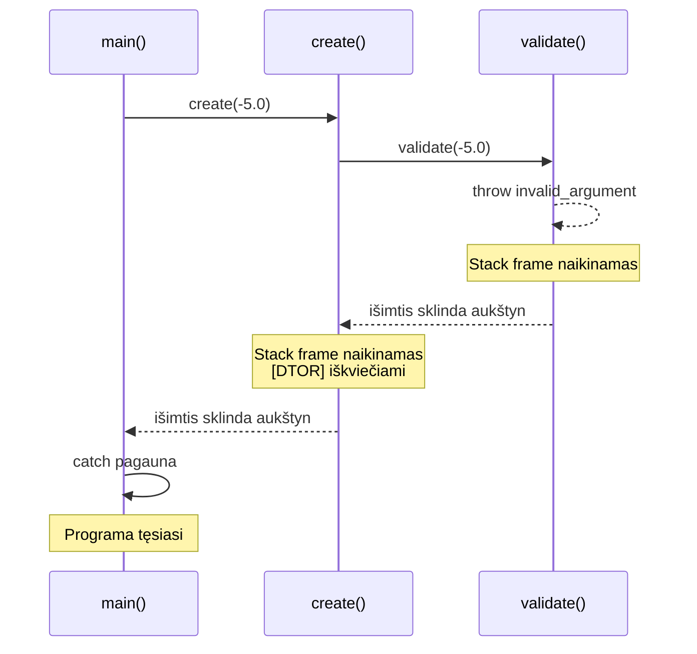
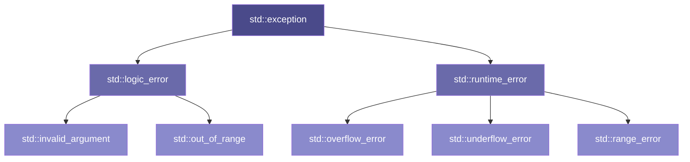

# Išimčių apdorojimas

---

## Įžanga: kas negerai su klaidų valdymu?

Iki šiol mūsų kodo klaidos atrodė taip:

```cpp linenums="1"
Circle c(0, 0, -5.0);   // ← radius < 0. Kas nutinka?
```

Konstruktorius tyliai sukuria objektą su neteisinga reikšme. `area()` grąžina neigiamą skaičių. `printInfo()` jį išspausdina. Programa "veikia" — bet **neteisingai**. Ir niekas nepraneša.

Tai ne teorinė problema. Tai kasdienė inžinerinė problema: **kaip signalizuoti, kad kažkas negerai?**

---

## 1 DALIS: Trys C būdai — ir kiekvieno kaina

!!! abstract "Šios dalies tikslas"
    Prieš `throw` — pažiūrėkime ką turėjome anksčiau.
    Kiekvienas C būdas išsprendžia vieną problemą, bet sukuria kitą.
    Tai ne istorija dėl istorijos — tai motyvacija kodėl `throw` egzistuoja.

---

### Būdas 1: grąžinamoji reikšmė

```c linenums="1"
// Senas geras C:
int divide(int a, int b) {
    if (b == 0) return -1;   // ← klaidos kodas
    return a / b;
}

int result = divide(10, 0);
if (result == -1) {
    // klaida!
}
```

**Problema:** o jei `-1` yra **teisėtas rezultatas**?

```c linenums="1"
int result = divide(-10, 10);  // → -1. Klaida ar teisingas atsakymas?
```

Neįmanoma atskirti. Tenka sugalvoti specialią "klaidos reikšmę" (`INT_MIN`, `NULL`, `0`...) — ir tikėtis, kad ji niekada nebus teisėta. Tai trapus susitarimas.

---

### Būdas 2: globalus klaidos kodas (`errno`)

```c linenums="1"
#include <errno.h>
#include <math.h>

errno = 0;
double result = sqrt(-1.0);

if (errno != 0) {
    // klaida!
}
```

**Problema 1:** ką daryti jei **pamiršai** patikrinti `errno`? Niekas neprimena.

**Problema 2:** kelių gijų (*multithreading*) aplinkoje `errno` — bendras globalus kintamasis. Dvi gijos rašo vienu metu → **race condition**.

**Problema 3:** o jei funkcijų grandinė gili?

```c linenums="1"
// Kas patikrina errno kiekviename lygmenyje?
result = f(g(h(x)));
```

---

### Būdas 3: išvestinis parametras (out parameter)

```c linenums="1"
bool divide(int a, int b, int* result) {
    if (b == 0) return false;   // ← grąžina sėkmę/nesėkmę
    *result = a / b;
    return true;
}

int result;
if (!divide(10, 0, &result)) {
    // klaida!
}
```

**Problema:** funkcijų grandinėje klaida turi "kopti" per **kiekvieną lygmenį**:

```c linenums="1"
bool readConfig(const char* path, Config* cfg);
bool parseConfig(Config* cfg, Settings* s);
bool applySettings(Settings* s, App* app);

// main() turi patikrinti kiekvieną žingsnį:
Config cfg;
if (!readConfig("app.cfg", &cfg)) { /* klaida */ return 1; }

Settings s;
if (!parseConfig(&cfg, &s))       { /* klaida */ return 1; }

if (!applySettings(&s, &app))     { /* klaida */ return 1; }
```

Klaidos kodas "per rankų perdavinėjamas" per visą grandinę. Dauguma kodo tampa **klaidos tikrinimo** kodu — ne verslo logikos.

---

### Konstruktoriaus "kampas"

Visi trys būdai turi vieną bendrą spragą — jie veikia **funkcijose**. Bet kas nutinka **konstruktoriuje**?

```cpp linenums="1"
class Circle : public Shape {
public:
    Circle(double x, double y, double r, const std::string& color)
        : Shape(x, y, color), radius(r)
    {
        if (r <= 0) {
            // Kaip signalizuoti klaidą?
            // return -1;   ← konstruktorius nieko negrąžina!
            // errno = ...  ← globalus, nepatikimas
            // bool* ok;    ← nėra tokio parametro
        }
    }
};
```

Konstruktorius **neturi grąžinamosios reikšmės**. Tai C++ tipo sistemos esmė — konstruktorius arba sukuria objektą, arba... nieko negali pasakyti.

!!! note "Čia tiksliai ir reikalingas `throw`"
    Ne kaip mada ar karkasas (*scaffolding*) — o kaip **vienintelis logikas sprendimas** situacijai, kurioje kiti būdai tiesiog neveikia.

---

## 2 DALIS: `throw`, `try`, `catch` — mechanika

!!! abstract "Šios dalies tikslas"
    Pamatysime `throw/try/catch` sintaksę su pažįstamais `Shape` pavyzdžiais.
    Tikslas — suprasti **du srautus**: normalų ir išimties.

---

### Du srautai

Normalus programos srautas — eilutė po eilutės, funkcija grąžina reikšmę, viskas nuoseklu. `throw` įveda **antrą srautą** — išimties kelią, kuriuo programa "šoka" iš vienos vietos į kitą, praleidžiant viską tarp jų.

```
normalus srautas  →→→→→→→→→→→→→→→→→→→→→→→→  tikslas
                          ↓ throw
išimties srautas  ~~~~~~~~~~~~~~~~~~~~~~~~→  catch
```

Tai ne klaida ir ne katastrofa — tai **alternatyvus valdymo srautas**. Bet jį reikia sąmoningai valdyti.

---

### Sintaksė

```cpp linenums="1"
#include <stdexcept>   // ← std::invalid_argument ir kt.

// Metame išimtį:
throw std::invalid_argument("radius turi būti teigiamas");

// Gauname išimtį:
try {
    Circle c(0, 0, -5.0);   // ← čia bus mesti
    c.printInfo();           // ← ši eilutė NEBUS pasiekta
}
catch (const std::invalid_argument& e) {
    std::cout << "Klaida: " << e.what() << "\n";
}
```

Trys veikėjai:

- **`throw`** — meta išimties objektą ir **nedelsiant nutraukia** dabartinį vykdymą
- **`try`** — blokas, kuriame **stebime** ar bus metama
- **`catch`** — blokas, kuris **pagauna** ir apdoroja išimtį

---

### `Circle` su validacija

```cpp linenums="1"
// Circle.cpp:
Circle::Circle(double x, double y, double r, const std::string& color)
    : Shape(x, y, color), radius(r)
{
    if (r <= 0) {
        throw std::invalid_argument(
            "Circle: radius turi būti teigiamas, gauta: " + std::to_string(r)
        );
    }
    std::cout << "[Circle CTOR] r=" << radius << "\n";
}
```

```cpp linenums="1"
// main.cpp:
try {
    Circle good(0, 0, 5.0, "red");    // ✅ veikia
    good.printInfo();

    Circle bad(0, 0, -3.0, "blue");   // ← throw čia
    bad.printInfo();                   // ← NEPASIEKIAMA
}
catch (const std::invalid_argument& e) {
    std::cout << "Klaida: " << e.what() << "\n";
}

std::cout << "Programa tęsiasi...\n";  // ← pasiekiama
```

```
[Shape CTOR] color=red
[Circle CTOR] r=5
Circle [color=red, center=(0,0), r=5, area=78.54]
[Shape CTOR] color=blue
Klaida: Circle: radius turi būti teigiamas, gauta: -3.000000
Programa tęsiasi...
```

!!! warning "Atkreipkite dėmesį"
    `[Shape CTOR] color=blue` **spausdinamas** — `Shape` dalis spėjo inicializuotis.
    `[Circle CTOR]` — **nespausdinamas**, `throw` nutraukė prieš tai.
    `[Shape DTOR]` — **spausdinamas** — destruktorius iškviečiamas automatiškai. Apie tai — 3 dalyje.

---

### Kelios išimtys — kelios `catch` šakos

```cpp linenums="1"
try {
    Rectangle r(0, 0, -4.0, 3.0, "blue");
}
catch (const std::invalid_argument& e) {
    std::cout << "Neteisinga reikšmė: " << e.what() << "\n";
}
catch (const std::out_of_range& e) {
    std::cout << "Už ribų: " << e.what() << "\n";
}
catch (const std::exception& e) {
    std::cout << "Klaida: " << e.what() << "\n";   // ← pagauna viską
}
```

`catch` šakos tikrinamos **iš viršaus į apačią** — pirma tinkanti pagauna. Specifinės — viršuje, bendros (`std::exception`) — apačioje.

---

## 3 DALIS: Stack unwinding

!!! abstract "Šios dalies tikslas"
    Kas nutinka su objektais kai `throw` "šoka" per kelis lygmenis?
    Atsakymas: destruktoriai iškviečiami automatiškai — tai RAII garantija.

---

### Funkcijų grandinė ir `throw`

```cpp linenums="1"
void validate(double r) {
    if (r <= 0)
        throw std::invalid_argument("blogas radius");
}

void create(double r) {
    validate(r);               // ← throw iš čia
    std::cout << "sukurta\n";  // ← NEPASIEKIAMA
}

int main() {
    try {
        create(-5.0);
        std::cout << "ok\n";   // ← NEPASIEKIAMA
    }
    catch (const std::exception& e) {
        std::cout << "Pagauta: " << e.what() << "\n";
    }
}
```

`throw` iš `validate()` — "šoka" per `create()`, per `main()` `try` bloką — tiesiai į `catch`. Visa tai — **stack unwinding**.

---

### Stack unwinding vizualiai



Kiekvienas **stack frame** naikinamas — ir kiekvieno lokalūs objektai **sunaikinami** (destruktoriai iškviečiami). Tai ne atsitiktinumas — tai **RAII garantija**, kuri veikia net su išimtimis.

---

### Matome destruktorius logging'e

```cpp linenums="1"
void demonstracija() {
    Circle c1(0, 0, 3.0, "red");     // sukuriamas
    Circle c2(0, 0, -1.0, "blue");   // ← throw čia
    Circle c3(0, 0, 2.0, "green");   // ← NIEKADA nesukuriamas
}

int main() {
    try {
        demonstracija();
    }
    catch (const std::exception& e) {
        std::cout << "Pagauta: " << e.what() << "\n";
    }
}
```

```
[Shape CTOR] color=red
[Circle CTOR] r=3
[Shape CTOR] color=blue
[Circle DTOR] r=3        ← c1 sunaikinamas (stack unwinding)
[Shape DTOR] color=red   ← c1 Shape dalis
[Shape DTOR] color=blue  ← c2 Shape dalis (Circle nebuvo baigtas)
Pagauta: Circle: radius turi būti teigiamas, gauta: -1.000000
```

!!! note "RAII + išimtys = saugi sistema"
    Destruktoriai iškviečiami **nepriklausomai** nuo to ar programa baigėsi normaliai ar per išimtį.
    Tai reiškia — resursai atlaisvinami visada. Tai RAII principo esmė.

    Kol dirbame su **stack objektais** (be `new`) — sistema saugi automatiškai.

---

## 4 DALIS: `std::exception` hierarchija

!!! abstract "Šios dalies tikslas"
    `std::invalid_argument` — tik viena iš daugelio standartinių išimčių.
    Pažiūrėkime į hierarchiją — kodėl ji tokia ir kaip ją naudoti.

---

### Hierarchija



**Dvi pagrindinės šakos:**

- **`logic_error`** — klaida programos **logikoje**: blogas argumentas, indeksas už ribų. Teoriškai išvengiama kompiliavimo metu.
- **`runtime_error`** — klaida **vykdymo metu**: failas nerastas, persipildymas. Neišvengiama iš anksto.

---

### Kurią naudoti?

| Situacija | Išimtis |
|---|---|
| Blogas konstruktoriaus argumentas | `std::invalid_argument` |
| Indeksas už masyvo ribų | `std::out_of_range` |
| Matematinis persipildymas | `std::overflow_error` |
| Failas nerastas, tinklo klaida | `std::runtime_error` |
| Norite savo kategorijos | Paveldėkite iš tinkamos bazinės |

```cpp linenums="1"
// Circle konstruktorius:
if (r <= 0)
    throw std::invalid_argument("radius turi būti teigiamas");

// vector indeksavimas:
if (i >= size)
    throw std::out_of_range("indeksas " + std::to_string(i) + " už ribų");
```

---

### Sava išimčių klasė

Kartais standartinių neužtenka — norisi savo kategorijos:

```cpp linenums="1"
// ShapeException.h:
#include <stdexcept>
#include <string>

class ShapeException : public std::invalid_argument {
public:
    explicit ShapeException(const std::string& msg)
        : std::invalid_argument("Shape klaida: " + msg) {}
};
```

```cpp linenums="1"
// Circle.cpp:
if (r <= 0)
    throw ShapeException("Circle radius=" + std::to_string(r) + " turi būti > 0");

// main.cpp — galima pagauti pagal tipą:
catch (const ShapeException& e) {
    std::cout << "Shape validacijos klaida: " << e.what() << "\n";
}
catch (const std::exception& e) {
    std::cout << "Kita klaida: " << e.what() << "\n";
}
```

Paveldėjimas veikia ir išimčių hierarchijoje — `catch (const std::exception& e)` pagauna ir `ShapeException`, nes ji **yra** `std::exception`.

---

## 5 DALIS: `new`, `throw` ir atminties nutekėjimas

!!! abstract "Šios dalies tikslas"
    Stack unwinding saugo **stack objektus**. Bet kas nutinka su **heap objektais** —
    kai naudojame `new` ir `throw` kartu?

---

### Problema

```cpp linenums="1"
void sukurti() {
    Shape* s = new Circle(0, 0, 5.0, "red");   // ← heap alokacija

    validate(s);   // ← jei čia throw — kas nutinka su s?

    delete s;      // ← NEPASIEKIAMA jei throw
}
```

`delete s` nepasiekiamas — atmintis **nuteka**. Stack unwinding sunaikina `s` kintamąjį (rodyklę) — bet ne objektą, į kurį ji rodo. Rodyklė dingo, objektas — heap'e, niekas jo neišvalo.

```
Stack:          Heap:
┌──────┐        ┌─────────────┐
│  s ──┼──────► │ Circle obj  │ ← niekas neišvalys!
└──────┘        └─────────────┘
  ↑ sunaikinta    ↑ nuteka
  (stack unwind)
```

---

### Iliustracija su logging'u

```cpp linenums="1"
void sukurti() {
    Shape* s = new Circle(0, 0, 5.0, "red");
    throw std::runtime_error("kažkas negerai");
    delete s;   // ← nepasiekiama
}

int main() {
    try { sukurti(); }
    catch (const std::exception& e) {
        std::cout << "Pagauta: " << e.what() << "\n";
    }
}
```

```
[Shape CTOR] color=red
[Circle CTOR] r=5
Pagauta: kažkas negerai
```

`[Circle DTOR]` ir `[Shape DTOR]` — **niekada nespausdinami**. Objektas sukurtas, bet neišvalytas. Atminties nutekėjimas.

---

### Sprendimas egzistuoja

Problema **išsprendžiama** — bet tai jau kito įrankio tema.

```cpp linenums="1"
// Užuomina į P10:
#include <memory>

void sukurti() {
    auto s = std::make_unique<Circle>(0, 0, 5.0, "red");
    // ↑ ne new/delete — unique_ptr

    throw std::runtime_error("kažkas negerai");
    // ↑ throw čia — bet unique_ptr destruktorius
    //   iškviečiamas automatiškai (stack unwinding!)
    //   Atminties nutekėjimo nėra.
}
```

```
[Shape CTOR] color=red
[Circle CTOR] r=5
[Circle DTOR] r=5        ← dabar iškviečiamas ✅
[Shape DTOR] color=red   ← dabar iškviečiamas ✅
Pagauta: kažkas negerai
```

`std::unique_ptr` — tai RAII pritaikytas heap objektams. Stack unwinding veikia nes `unique_ptr` pats yra **stack objektas**, kurio destruktorius kviečia `delete`. Tai **P10** tema.

!!! tip "Žvilgsnis į priekį: P10"
    `new`/`delete` + išimtys = atminties nutekėjimo pavojus.
    `unique_ptr` + išimtys = saugi automatiškai.
    
    RAII principas, kurį žinote nuo P06 — čia pasirodo pilna jėga.

---

!!! tip "Užduotis U7"
    Išimčių mechaniką išbandysite **U7 žingsniuose 1–5**:

    - **Žingsnis 1:** `BankAccount` su `throw` — apšilimas
    - **Žingsnis 2:** `Circle`/`Rectangle` validacija konstruktoriuose
    - **Žingsnis 3:** `try/catch` `main.cpp` — sugauti ir tęsti
    - **Žingsnis 4:** `setRadius()` su `throw` — ne tik konstruktoriuje
    - **Žingsnis 5:** Sava išimčių klasė

---

*[RAII]: Resource Acquisition Is Initialization
*[NC]: Not Compiling — Nesikompiliuoja
