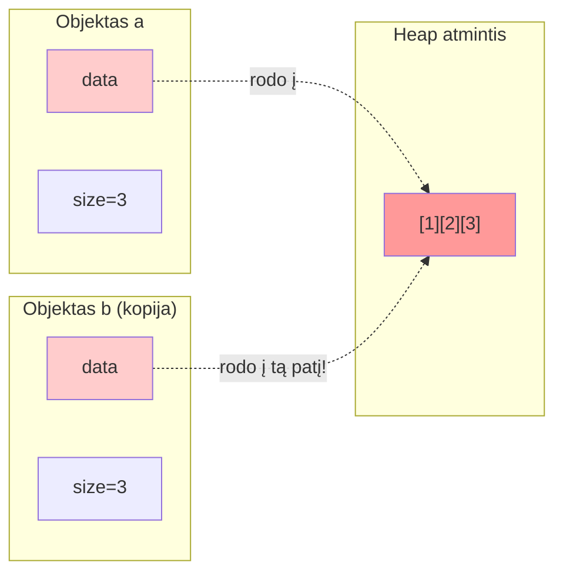
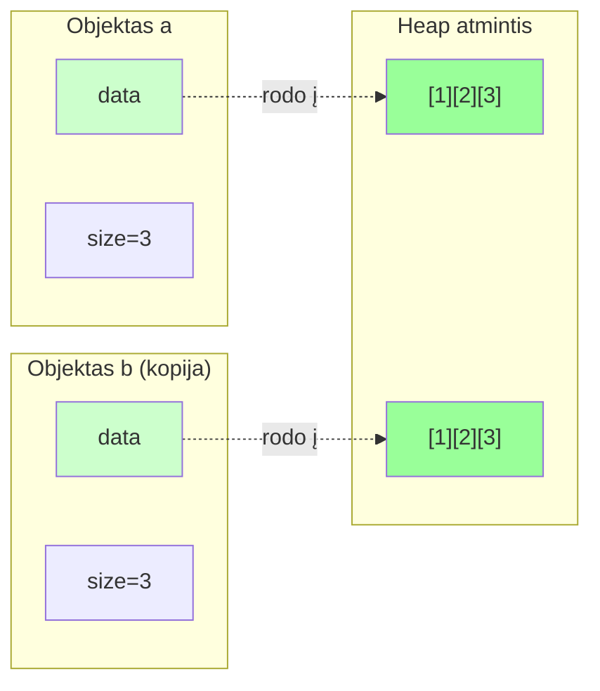

# RAII, Kopijavimas, Rule of Three

---

## 1 DALIS: RAII ir destruktorius

!!! abstract "Šios dalies tikslas"
    Iki šiol mūsų klasės nenaudojo dinaminės atminties — laukai gyveno „automatiškai".
    Kai klasė apsiima valdyti ir užimti **dinaminę atmintį** (su `new`), atsiranda nauja atsakomybė: **kas ją turi atlaisvinti?**

    - Pažinsime **RAII** principą — resursų valdymas per objekto gyvavimo ciklą
    - Pamatysime kodėl destruktorius tampa **būtinu**, ne formaliu
    - Atrasime **shallow copy problemą** — kodėl numatytoji (_default_) kopija čia pavojinga

---

### Problema: kas atlaisvina atmintį?

#### **Lygis 1: C stiliaus duomenys**

```cpp linenums="1"
// Primityvi C struktūra — tik stack
struct Studentas {
    char vardas[50];      // C array — automatiškai gyvena stack'e
    int amzius;           // primityvus tipas
};
// Destruktorius? Nereikalingas — nieko trinti nereikia.
```

**Kodėl nereikia destruktoriaus?**

- `char[50]` — automatinis masyvas stack'e, ne heap'e
- `int` primityvus/bazinis tipas — gyvena automatiškai
- Numatytojo (_default_) destruktoriaus pakanka

---

#### **Lygis 2: C++ klasės su RAII (std::string)**

```cpp linenums="1"
// C++ "smart" klasės — RAII principas
class Studentas {
    std::string vardas;   // std::string pats valdo savo atmintį!
    int amzius;
};
// Destruktorius? Vis dar nereikalingas!
```

**Kodėl vis dar nereikia destruktoriaus?**

- `std::string` **pats turi destruktorių** → atlaisvina savo dinaminę atmintį
- `std::string` viduje: `char* data` + `new`/`delete` → bet **paslėpta!**
- Tai RAII principas: resursas valdomas objekto gyvavimo ciklu
- Numatytasis destruktorius iškviečia `vardas.~string()` → viską parūpina "sistema"

**Kas vyksta "po gaubtu"?**
```cpp
class std::string {
    char* data;    // Dinaminis masyvas (heap)
    size_t len;
public:
    string(const char* s) { data = new char[...]; }   // RAII: įsigijimas
    ~string()             { delete[] data; }          // RAII: atlaisvinimas
};
```

**Išvada:** `std::string` — tai **RAII pavyzdys**! Mes ją naudojame, bet ji pati valdo atmintį.

---

#### **Lygis 3: Kompozicija su STL konteineriais (U3)**

```cpp linenums="1"
// Kompozicija — objektai viduje objektų
class Room {
    std::vector<Window> windows;  // vector pats valdo savo atmintį
    Door* door;                   // ⚠️ Rodyklė! Bet kurgi Door objektas?
};
```

**Destruktorius reikalingas?**

- `std::vector<Window>` — pats turi destruktorių ✅
- `Door*` — TIK RODYKLĖ, bet:
  - U3 atveju: `door` rodė į **išorinį** objektą (ne Room sukurtą)
  - Room **nevaldė** Door atminties → destruktorius **nereikalingas**
  - Kitaip tariant: Room tik "žiūrėjo" į Door, bet ne "valdė"

**Kas vyksta po gaubtu?**
```cpp
Room::~Room() {  // Numatytasis (default) — kompiliatorius sugeneruoja
    // windows.~vector();  ← vector destruktorius atlaisvina savo atmintį
    // door rodyklė nukopijuojama ir sunaikinama, BET ne Door objektas
}
```

!!! note "U3/BONUS pastebėjimas"
    - `vector`, kaip ir dera "teisingam" tipui, įgyvendina **Rule of Three** → kopijuoja objektus teisingai
    - Kai `vector` kopijuojamas → `Window` objektai taip pat kopijuojami
    - Matėme: reikėjo user-defined copy constructor!

**Išvada:** `std::vector` (kaip ir `std::string`) — tai **RAII pavyzdys**! Jis valdo dinaminį masyvą.

---

#### **Lygis 4: Tiesioginis dinaminės atminties valdymas (U4)**

```cpp linenums="1"
// Dabar — PIRMĄ KARTĄ patys valdome dinaminę atmintį!
class IntArray {
    int* data;    // rodyklė į dinaminę atmintį (kurią MES sukūrėme!)
    int size;
    // ⚠️ Kas padarys delete[]?
};
```

**Kodėl DABAR reikalingas destruktorius?**

- `int*` — rodyklė į atmintį, **kurią PATYS alokavome** su `new`
- Skirtumas nuo Lygių 2-3: **mes valdome** šią atmintį — ne kas kitas
- `new` atliko klasės autorius/programuotojas → `delete[]` turi atlikti irgi jis
- Numatytasis destruktorius **NIEKO NEDARO** su `data` rodykle
- Rezultatas: **atminties nutekėjimas** (_memory leak_)

**Problema:**
```cpp
IntArray arr(5);  // Konstruktoriuje: data = new int[5]
// ... naudojame arr ...
// arr išeina iš scope → destruktorius?
// ❌ Numatytasis destruktorius: data rodyklė sunaikinta
// ❌ Atmintis heap'e (new int[5]) NEATLAISVINTA → memory leak!
```

**Išvada**: Turime kurti savo klasę besielgiančią kaip RAII klasės — kaip `std::string` ar `std::vector`!

---

#### **Reziumuokime:**

| Klasė | Laukai | Destruktorius reikalingas? | Priežastis |
|-------|--------|----------------------------|------------|
| `Studentas` (C) | `char[50]`, `int` | ❌ Ne | Stack, ne heap |
| `Studentas` (C++) | `std::string`, `int` | ❌ Ne | std::string turi RAII |
| `Room` | `std::vector<Window>`, `Door*` | ❌ Ne | vector turi RAII; Door* nevaldoma |
| `IntArray` | `int*`, `int` | ✅ **TAIP!** | **Mes valdome** atmintį (new/delete) |

**Svarbi taisyklė:**

Jei klasė **pati tiesiogiai** kviečia/naudoja `new` ir **valdo** tą atmintį → ji turi turėti **destruktorių** su `delete`.

Jei niekas nepasirūpins `delete`/`delete[]` — įvyks **atminties nutekėjimas** (_memory leak_):
programa "valgo" atmintį, kol OS ją atsiima proceso pabaigoje.

---

### RAII principas

**RAII** = _Resource Acquisition Is Initialization_ —
**resursas įgyjamas konstruktoriuje, atlaisvinamas destruktoriuje**.

```
Konstruktorius:   new   → atmintis "įgyta"
     ...objektas naudojamas...
Destruktorius:  delete  → atmintis atlaisvinta automatiškai!
```

Svarbiausia — destruktorius iškviečiamas **automatiškai** kuomet baigiasi objekto galiojimo sritis (_scope_).
Programuotojas negali „pamiršti" atlaisvinti.

---

### IntArray — pirmasis RAII objektas

=== "IntArray.h"

    ```cpp linenums="1"
    #pragma once

    class IntArray {
        int* data;
        int  size;
    public:
        explicit IntArray(int n);
        ~IntArray();

        int  get(int i)        const;
        void set(int i, int v);
        int  getSize()         const;
        void spausdinti()      const;
    };
    ```

=== "IntArray.cpp"

    ```cpp linenums="1" hl_lines="7 12"
    #include "IntArray.h"
    #include <iostream>
    #include <stdexcept>

    IntArray::IntArray(int n) : size(n) {
        std::cout << "[CTOR] IntArray(" << n << ")\n";
        data = new int[n];
        for (int i = 0; i < n; ++i) {
            data[i] = 0;
        }
    //    data = new int[n]{};   // C++11 universalus {} - inicializuojame nuliais
    }

    IntArray::~IntArray() {
        std::cout << "[DTOR] IntArray(" << size << ")\n";
        delete[] data;         // ← RAII: atlaisviname čia
    }

    int IntArray::get(int i) const {
        if (i < 0 || i >= size)
            throw std::out_of_range("Indeksas už ribų");
        return data[i];
    }

    void IntArray::set(int i, int v) {
        if (i < 0 || i >= size)
            throw std::out_of_range("Indeksas už ribų");
        data[i] = v;
    }

    int  IntArray::getSize()    const { return size; }

    void IntArray::spausdinti() const {
        std::cout << "[ ";
        for (int i = 0; i < size; ++i)
            std::cout << data[i] << " ";
        std::cout << "]\n";
    }
    ```

=== "main.cpp"

    ```cpp linenums="1"
    #include "IntArray.h"
    #include <iostream>

    int main() {
        {
            IntArray a(4);
            a.set(0, 10); a.set(1, 20);
            a.set(2, 30); a.set(3, 40);
            a.spausdinti();
        }   // ← destruktorius čia — delete[] automatiškai

        std::cout << "--- po bloko ---\n";
        return 0;
    }
    ```

=== "🖥️"

    ```
    [CTOR] IntArray(4)
    [ 10 20 30 40 ]
    [DTOR] IntArray(4)
    --- po bloko ---
    ```

??? success "RAII veikia"
    Destruktorius iškviestas **automatiškai** bloko pabaigoje.
    Net jei tarp konstruktoriaus ir destruktoriaus būtų išimtis —
    C++ garantuoja destruktoriaus iškvietimą. Atmintis **negali nutekėti**.

---

### Shallow copy problema

Dabar — kodėl numatytoji kopija pavojinga:

```cpp linenums="1" hl_lines="5"
int main() {
    IntArray a(3);
    a.set(0, 1); a.set(1, 2); a.set(2, 3);

    IntArray b = a;   // ← atrodo nekaltai...

    b.set(0, 99);
    a.spausdinti();   // tikimės: [ 1 2 3 ]
                      // gauname: [ 99 2 3 ]  😱
    return 0;
    // + CRASH: delete[] du kartus!
}
```

**Kodėl?** Kompiliatorius sugeneruoja **shallow copy** — kopijuoja laukus bitų lygmeniu (dar sakoma - _bitwise copy_):



Abu objektai rodo į **tą pačią atmintį**. Pakeitus `b` — keičiasi `a`.
Sunaikinus abu — `delete[]` **dvigubai** tam pačiam adresui → "griūtis/lūžis".

!!! danger "Shallow copy + dinamika = problema"
    Numatytasis kopijavimo konstruktorius yra **pavojingas** kai klasė naudoja dinaminę atmintį. 
    Sprendimas — **2 DALIS**: Kopijavimo konstruktorius.

---

!!! tip "Užduotis U4"
    1 dalies teoriją patikrinsite **U4 Žingsniuose 1-2**:
    
    - **Žingsnis 1:** Shallow copy problema (IntArray)
    - **Žingsnis 2:** Deep copy su copy constructor

---

## 2 DALIS: Kopijavimo konstruktorius

!!! abstract "Šios dalies tikslas"
    1 dalies problemos sprendimas: **kopijavimo konstruktorius** (_copy constructor_).

    - Kada jis (dar) kviečiamas (ne tik `ClassName b = a` !)
    - Kaip rašyti **gilų kopijavimą** (_deep copy_)
    - Pataisyti `IntArray` ir `MyString`

---

### Kada kviečiamas copy constructor?

Dažniau nei manome:

```cpp
IntArray a(3);

IntArray b = a;          // 1. inicializavimas kopija
IntArray c(a);           // 2. tas pats, kita sintaksė
IntArray d(a);           // 3. tas pats, dar kita sintaksė - "universalus inicijavimas" (C++11)

void f(IntArray x) {}
f(a);                    // 4. perdavimas į funkciją per reikšmę

IntArray sukurti() { IntArray t(2); return t; }
IntArray e = sukurti();  // 5. grąžinimas iš funkcijos (gali optimizuoti)
```

Jei jo neparašėme — kompiliatorius naudoja **numatytąjį** (shallow).

---

### Copy constructor sintaksė

```cpp
ClassName(const ClassName& other);
//                ^^^^^                    ^^^^^
//                nekeičiame              originalas
```

- Parametras — **`const` nuoroda**: nekopijuojame kopijuodami, ir nekeičiame originalo
- Kūne — sukuriame **naują** resursą su tuo pačiu turiniu

---

### `IntArray` pavyzdys su deep copy

=== "IntArray.h (papildyta)"

    ```cpp linenums="1" hl_lines="8"
    #pragma once

    class IntArray {
        int* data;
        int  size;
    public:
        explicit IntArray(int n);
        IntArray(const IntArray& kitas);   // ← copy constructor
        ~IntArray();

        int  get(int i)        const;
        void set(int i, int v);
        int  getSize()         const;
        void spausdinti()      const;
    };
    ```

=== "IntArray.cpp (papildyta)"

    ```cpp linenums="1" hl_lines="1-7"
    IntArray::IntArray(const IntArray& kitas)
        : size(kitas.size) {
        std::cout << "[COPY] IntArray(" << size << ")\n";
        data = new int[size];                    // naujas masyvas
        for (int i = 0; i < size; ++i)
            data[i] = kitas.data[i];             // kopijuojame turinį
    }
    ```

=== "main.cpp (testas)"

    ```cpp linenums="1"
    int main() {
        IntArray a(3);
        a.set(0, 1); a.set(1, 2); a.set(2, 3);

        IntArray b = a;      // copy constructor — gilus!
        b.set(0, 99);

        std::cout << "a: "; a.spausdinti();   // [ 1 2 3 ]  ✓
        std::cout << "b: "; b.spausdinti();   // [ 99 2 3 ] ✓
        return 0;
    }
    ```

=== "🖥️"

    ```
    [CTOR] IntArray(3)
    [COPY] IntArray(3)
    a: [ 1 2 3 ]
    b: [ 99 2 3 ]
    [DTOR] IntArray(3)
    [DTOR] IntArray(3)
    ```

**Deep copy vizualizacija:**



Dabar — **du atskiri masyvai**, du atskiri destruktoriai. ✓

```
a:  [ data ──►  [1][2][3]   ]
b:  [ data ──►  [99][2][3]  ]   ← atskira kopija
```

---

### `MyString` pavyzdys su deep copy

=== "MyString.cpp (papildyta)"

    ```cpp linenums="1" hl_lines="1-8"
    MyString::MyString(const MyString& kitas)
        : len(kitas.len) {
        std::cout << "[COPY] MyString(\"" << kitas.data << "\")\n";
        data = new char[len + 1];
        std::strcpy(data, kitas.data);   // kopijuojame simbolius
    }
    ```

=== "main.cpp (testas)"

    ```cpp linenums="1"
    void spausdintiKopija(MyString s) {   // ← copy constructor čia!
        s.spausdinti();
    }

    int main() {
        MyString s1("Labas");
        MyString s2 = s1;            // copy constructor "klasika"

        spausdintiKopija(s1);        // copy constructor "call/pass by value" atveju

        s1.spausdinti();             // originalas nepakeistas
        s2.spausdinti();
        return 0;
    }
    ```

=== "🖥️"

    ```
    [CTOR] MyString("Labas")
    [COPY] MyString("Labas")    ← MyString s2 = s1
    [COPY] MyString("Labas")    ← perdavimas į funkciją
    "Labas"
    [DTOR] MyString("Labas")    ← funkcijos parametras
    "Labas"
    "Labas"
    [DTOR] MyString("Labas")
    [DTOR] MyString("Labas")
    ```

!!! tip "Kiekvienas [COPY] turi savo [DTOR]"
    Protokolas dabar subalansuotas: kiekvienas sukūrimas (CTOR arba COPY)
    turi lygiai vieną DTOR porą. Tai ženklas kad atminties valdymas teisingas.

---

!!! tip "Užduotis U4"
    2 dalies teoriją patikrinsite **U4 Žingsniuose 2 ir 4**:
    
    - **Žingsnis 2:** IntArray kopijavimo konstruktorius
    - **Žingsnis 4:** MyString kopijavimo konstruktorius
    
    → [U4: Trijų Taisyklė](../Pratybos/U4.md)

---

## 3 DALIS: Kopijos priskyrimas (_Copy Assignment_) ir Trijų Taisyklė (_Rule of Three_)

!!! abstract "Šios dalies tikslas"
    Copy constructor išsprendė kopijavimą **inicializuojant**.
    Bet kas kai objektas **jau egzistuoja** ir priskiriam jam naują reikšmę?

    ```cpp
    IntArray a(3), b(5);
    b = a;   // ← ne copy constructor — tai operator=!
    ```

    - **`operator=`** — priskyrimo operatoriaus perkrovimas
    - **Savęs priskyrimo** patikra — subtilus, bet svarbus atvejis
    - **Rule of Three** — kada reikia visų trijų kartu

---

### Copy constructor vs operator=

```cpp
IntArray a(3);

IntArray b = a;   // ← COPY CONSTRUCTOR: b dar neegzistavo
b = a;            // ← OPERATOR=: b jau egzistuoja, keičiame jo turinį
```

Skirtumas svarbus — `operator=` turi pirmiau **sunaikinti seną turinį**.

---

### operator= — žingsnis po žingsnio

**Trys žingsniai:**

```
1. Patikrinti savęs priskyrimą  (a = a — nieko nedaryti)
2. Sunaikinti seną turinį       (delete[] senas data)
3. Sukurti naują kopiją         (new + kopijuoti)
```

=== "IntArray.h (papildyta)"

    ```cpp linenums="1" hl_lines="9"
    class IntArray {
        int* data;
        int  size;
    public:
        explicit IntArray(int n);
        IntArray(const IntArray& kitas);
        ~IntArray();
        IntArray& operator=(const IntArray& kitas);   // ← naujas
        // ...
    };
    ```

=== "IntArray.cpp (papildyta)"

    ```cpp linenums="1" hl_lines="1-13"
    IntArray& IntArray::operator=(const IntArray& kitas) {
        std::cout << "[ASSIGN]\n";

        if (this == &kitas)          // 1. savęs priskyrimas?
            return *this;            //    nieko nedaryti

        delete[] data;               // 2. sunaikinti seną

        size = kitas.size;           // 3. sukurti naują kopiją
        data = new int[size];
        for (int i = 0; i < size; ++i)
            data[i] = kitas.data[i];

        return *this;                // leidžia: a = b = c
    }
    ```

=== "main.cpp (testas)"

    ```cpp linenums="1"
    int main() {
        IntArray a(3);
        a.set(0,1); a.set(1,2); a.set(2,3);

        IntArray b(5);               // visiškai kitoks dydis
        b = a;                       // operator=

        b.set(0, 99);
        std::cout << "a: "; a.spausdinti();   // [ 1 2 3 ]
        std::cout << "b: "; b.spausdinti();   // [ 99 2 3 ]

        a = a;                       // savęs priskyrimas — saugus
        std::cout << "a=a: "; a.spausdinti(); // [ 1 2 3 ]
        return 0;
    }
    ```

=== "🖥️"

    ```
    [CTOR] IntArray(3)
    [CTOR] IntArray(5)
    [ASSIGN]
    a: [ 1 2 3 ]
    b: [ 99 2 3 ]
    [ASSIGN]
    a=a: [ 1 2 3 ]
    [DTOR] IntArray(3)
    [DTOR] IntArray(3)
    ```

??? danger "Kodėl savęs priskyrimo patikra būtina?"
    ```cpp
    // Be patikros — katastrofa:
    IntArray& operator=(const IntArray& kitas) {
        delete[] data;               // ← ištriname data
        // jei this == &kitas, tai kitas.data jau ištrintas!
        data = new int[kitas.size];  // kitas.size — galioja
        // kitas.data — jau nevalidi atmintis  😱
    }
    ```
    `a = a` be patikros — **undefined behavior**.

---

### MyString su operator=

=== "MyString.cpp (papildyta)"

    ```cpp linenums="1"
    MyString& MyString::operator=(const MyString& kitas) {
        std::cout << "[ASSIGN] MyString\n";
        if (this == &kitas) return *this;

        delete[] data;                           // senas — šalin

        len  = kitas.len;
        data = new char[len + 1];
        std::strcpy(data, kitas.data);

        return *this;
    }
    ```

---

### Rule of Three

!!! tip "Rule of Three"
    Jei klasė apibrėžia **bet kurį** iš šių trijų — beveik tikrai reikia **visų trijų**:

    | Metodas | Kada reikia |
    |---|---|
    | `~KlasėsPavadinimas()` | Destruktorius kažką daro (`delete`, užveria failą...) |
    | `KlasėsPavadinimas(const KlasėsPavadinimas&)` | Nukopijuoti resursą, ne rodyklę |
    | `KlasėsPavadinimas& operator=(const KlasėsPavadinimas&)` | Pakeisti jau egzistuojantį objektą |

**Kodėl taisyklė veikia:**
jei destruktorius daro `delete` — reiškia klasė valdo dinaminę atmintį.
Tada numatytasis copy constructor ir `operator=` (shallow) yra **pavojingi**.

```cpp
// Pilna IntArray su Rule of Three:
class IntArray {
    int* data;
    int  size;
public:
    explicit IntArray(int n);              // konstruktorius
    ~IntArray();                           // destruktorius     ← Rule of Three
    IntArray(const IntArray& kitas);       // copy constructor  ← Rule of Three
    IntArray& operator=(const IntArray&);  // operator=         ← Rule of Three
    // ...
};
```

---

### Viskas kartu — pilnas testas

=== "main.cpp"

    ```cpp linenums="1"
    #include "IntArray.h"
    #include <iostream>

    void perduotiKopija(IntArray x) {         // copy constructor
        x.set(0, 777);
        std::cout << "funkcijoje: "; x.spausdinti();
    }

    int main() {
        // ── Konstruktorius ──────────────────────────────
        IntArray a(3);
        a.set(0,1); a.set(1,2); a.set(2,3);

        // ── Copy constructor ────────────────────────────
        IntArray b = a;
        b.set(2, 99);
        std::cout << "a po b=a: "; a.spausdinti();  // nepakeistas

        // ── Perdavimas į funkciją ───────────────────────
        perduotiKopija(a);
        std::cout << "a po f(): "; a.spausdinti();  // nepakeistas

        // ── operator= ───────────────────────────────────
        IntArray c(10);
        c = a;
        c.set(0, 555);
        std::cout << "a po c=a: "; a.spausdinti();  // nepakeistas
        std::cout << "c:        "; c.spausdinti();

        // ── Savęs priskyrimas ───────────────────────────
        a = a;
        std::cout << "a po a=a: "; a.spausdinti();  // nepakeistas

        return 0;
    }
    ```

=== "🖥️"

    ```
    [CTOR] IntArray(3)
    [COPY] IntArray(3)
    a po b=a: [ 1 2 3 ]
    [COPY] IntArray(3)
    funkcijoje: [ 777 2 3 ]
    [DTOR] IntArray(3)
    a po f(): [ 1 2 3 ]
    [CTOR] IntArray(10)
    [ASSIGN]
    a po c=a: [ 1 2 3 ]
    c:        [ 555 2 3 ]
    [ASSIGN]
    a po a=a: [ 1 2 3 ]
    [DTOR] IntArray(3)
    [DTOR] IntArray(3)
    [DTOR] IntArray(3)
    ```

---

### Rule of Three — MyString (pilna versija)

=== "MyString.h (pilna)"

    ```cpp linenums="1"
    #pragma once

    class MyString {
        char* data;
        int   len;
    public:
        MyString(const char* s = "");
        ~MyString();
        MyString(const MyString& kitas);
        MyString& operator=(const MyString& kitas);

        int         length()         const;
        const char* c_str()          const;
        void        spausdinti()     const;
    };
    ```

---

??? tip "🔬 Bonus: copy-and-swap idioma"

    Klasikinis `operator=` turi subtilų trūkumą: jei `new` meta išimtį —
    objektas lieka sugadintas (senas `data` jau ištrintas, naujo nėra).

    **copy-and-swap** sprendžia tai elegantiškai:

    ```cpp
    // Reikalingas: #include <utility> dėl std::swap

    MyString& MyString::operator=(MyString kitas) {
    //                             ^^^^^^^
    //                    kopija per REIKŠMĘ — copy ctor jau veikia!
        std::swap(data, kitas.data);
        std::swap(len,  kitas.len);
        return *this;
        // kitas destruktorius sunaikina SENĄ data — automatiškai ✓
    }
    ```

    **Kaip veikia:**
    ```
    a = b  →  sukuriama kopija b' (copy ctor)
              sukeičiamos a ir b' rodyklės (swap)
              b' destruktorius sunaikina senąją a atmintį
    ```

    **Privalumai:**
    - **Exception-safe**: jei copy ctor meta išimtį — originalas nepakeistas
    - **Savęs priskyrimo patikros nereikia** — `a = a` sukuria kopiją, sukeičia, sunaikina: veikia teisingai
    - **Trumpesnis kodas** — logika pakartotinai nenaudojama

    **Mokymosi pastaba:**
    copy-and-swap reikalauja kad copy constructor **jau veiktų teisingai** —
    todėl natūraliai yra **po** 2 DALIS. Jei neįdomu dabar — grįšime vėliau (move semantika),
    kur ši idioma suvaidina dar svarbesnį vaidmenį.

---

!!! tip "Užduotis U4"
    3 dalies teoriją patikrinsite **U4 Žingsniuose 3, 5 ir 6**:
    
    - **Žingsnis 3:** IntArray operator= ir Rule of Three
    - **Žingsnis 5:** MyString operator= ir concatenation (operator+)
    - **Žingsnis 6:** BONUS operatoriai (operator[], ==, <<, <)

---

*[RAII]: Resource Acquisition Is Initialization
*[RT]: Runtime Error — Vykdymo klaida
*[NC]: Not Compiling — Nesikompiliuoja
