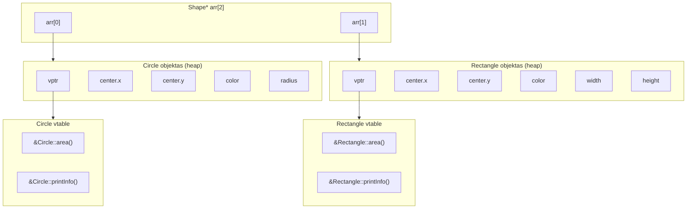
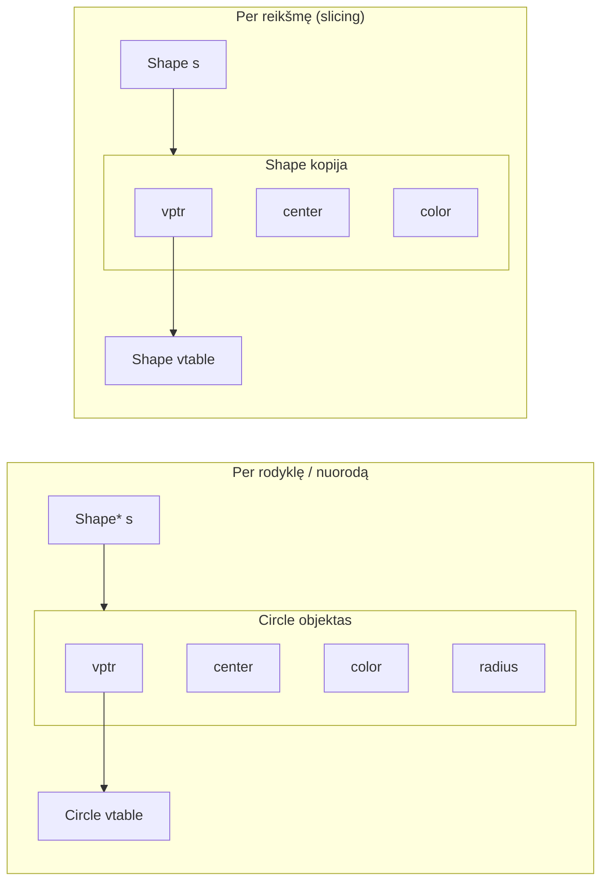

# Polimorfizmas

---

## Įžanga: kas yra polimorfizmas?

**Polimorfizmas** (gr. *πολύς* — daug, *μορφή* — forma) — gebėjimas **vienam interfeisui** veikti su **skirtingų tipų** objektais, kai kiekvienas tipas pateikia **savo** elgsenos variantą.

Biologijoje polimorfizmas — kai viena rūšis turi daug skirtingų formų. Programavime — kai vienas kreipinys/kvietimas `s->area()` duoda skirtingus rezultatus priklausomai nuo to, koks objektas "slypi" už rodyklės.

Bjarne Stroustrup:

> *"Programming using class hierarchies and virtual functions to allow manipulation of objects of a variety of types through well-defined interfaces."*

---

### Jau turėjome polimorfizmą

Nuo pat pirmų paskaitų naudojome **perkrovimą** (overloading) — tai vadinamsis **statinis polimorfizmas**:

```cpp linenums="1"
// U2, U3, U4 — konstruktorių perkrovimas:
Shape(double x, double y);                            // konstruktorius 1
Shape(double x, double y, const std::string& color);  // konstruktorius 2

// Tas pats vardas, skirtinga signatūra — kompiliatorius parenka teisingą
Shape s1(0, 0);           // → Shape(double, double)
Shape s2(0, 0, "red");    // → Shape(double, double, string)
```

**Statinio** polimorfizmo savybė/esmė — sprendimas priimamas **kompiliavimo metu**.

Šioje paskaitoje — kitas lygmuo: **dinaminis** polimorfizmas, kuomet sprendimas priimamas **vykdymo metu**.

---

### Paveldėjimas ir polimorfizmas — kas juos sieja

Paveldėjimas (P07) sukūrė **struktūrą**: `Circle IS-A Shape`, `Rectangle IS-A Shape`.

Polimorfizmas suteikia šiai struktūrai **elgseną**: tas pats kodas, dirbantis su `Shape*`, automatiškai elgiasi skirtingai su `Circle` ir `Rectangle`.

```
Paveldėjimas:    Sukuria hierarchiją (struktūra)
Polimorfizmas:   Suteikia hierarchijai gyvybę (elgsena)
```

---

### **overloading** vs **overriding**

```
Overloading  (perkrovimas)  — tas pats vardas, skirtinga signatūra
                               Shape(double x, double y)
                               Shape(double x, double y, string color)
                               → statinis polimorfizmas

Overriding   (perdengimas)  — tas pats vardas, identiška signatūra, paveldėtoje klasėje
                               Shape::area()   → Circle::area()
                               → be virtual: statinis perdengimas
                               → su virtual: dinaminis polimorfizmas ← ČIA ESAME

Overloading ≠ Overriding    — dažna painiava, skirtingi mechanizmai!
```

!!! note "Terminija"
    Šioje paskaitoje nagrinėsime **overriding su `virtual`** — tai tikrasis
    **dinaminis polimorfizmas** (dynamic binding, dynamic dispatch).
    Perkrovimas (overloading) — tai statinis polimorfizmas, kurį jau žinote.

---

### Polimorfinė klasė

!!! note "Apibrėžimas"
    Klasė vadinama **polimorfine**, jei turi bent vieną `virtual` metodą.
    
    Tik polimorfinės klasės objektai gali dalyvauti dinaminiame susiejime (dynamic binding).

??? tip "Polimorfizmo rūšys — plačiau"
    C++ polimorfizmas skirstomas į:

    | | **Statinis** (compile-time) | **Dinaminis** (run-time) |
    |---|---|---|
    | **Mechanizmas** | Perkrovimas (overloading), šablonai (templates) | Perdengimas (overriding), virtualios funkcijos |
    | **Sprendimas** | Kompiliavimo metu | Vykdymo metu |
    | **Greitis** | Greitesnis | Šiek tiek lėtesnis (vptr/vtable) |

    Plačiau apie polimorfizmo rūšis — žr. [P08 papildoma medžiaga](08_Paskaita_v2_ext.md).

---
---

## 1 DALIS: static binding -> `virtual` -> dynamic binding

!!! abstract "Šios dalies tikslas"
    P07 pabaigoje matėme: `Shape*` rodyklė į `Circle` objektą — bet `area()`
    grąžina `0.0`. Kodėl? Ir kaip vienu raktažodžiu tai ištaisyti?

    - Suprasime **static binding** — kodėl kompiliatorius parenka neteisingą metodą
    - Atrasime `virtual` — raktažodį, keičiantį "C++ sistemos" "žaidimo taisykles"
    - Pamatysime **vtable/vptr** mechanizmą — kaip dynamic binding veikia "po gaubtu"

---

### Problema: static binding

Iš P07 žinome — `Shape*` gali rodyti į `Circle` objektą - **upcasting**:

```cpp linenums="1"
Circle c(0, 0, 5.0);
Shape* s = &c;        // ← upcasting, veikia ✅
```

`Circle` turi savo `area()` — ji egzistuoja ir veikia teisingai tiesiogiai!, bet neveikia per rodyklę (po upcasting'o):

```cpp linenums="1"
c.area();   // ✅ Circle::area() → 78.54  (tiesiogiai — veikia)
s->area();  // ❌ Shape::area()  → 0.0    (per Shape* — ne!)
```

Problema — **static binding** (statinis susiejimas): kompiliatorius parenka metodą **kompiliavimo metu** pagal **rodyklės tipą** (`Shape*`), ne pagal tikrąjį objekto tipą (`Circle`).

```
Kompiliavimo metu:  s yra Shape*     →  Shape::area()   ← kompiliatorius parenka
Vykdymo metu:       s rodo į Circle  →  Circle::area()  ← norėtume, bet negauname
```

Be `virtual` — kompiliatorius elgiasi **teisingai pagal tipų sistemą**. Tiesiog ne taip, kaip mes *norėtume*. Tai ne klaida — tai numatytoji C++ elgsena.

!!! warning "static binding vs static linkage"
    **Nesupainiokit** kelių skirtingų "static" prasmių C++:

    | Terminas | Prasmė |
    |---|---|
    | **Static binding** | Metodo parinkimas **kompiliavimo metu** |
    | **Static linkage** | "Simbolio" matomumas **kompiliacijos vienete** (linker) |
    | **`static` narys** | Kintamasis/metodas priklausantis **klasei**, ne objektui |

    Tas pats žodis/raktažodis, skirtinga prasmė.

---

### Sprendimas: `virtual`

Vienas raktažodis `Shape.h` faile pakeičia viską:

```cpp linenums="1"
class Shape {
public:
    virtual double area() const;       // ← virtual!
    virtual void printInfo() const;    // ← virtual!
    // virtual ~Shape();               // ← apie tai — 2 dalyje
};
```

Dabar kompiliatorius **nebefiksuoja** metodo kompiliavimo metu. Sprendimas atidedamas į **vykdymo laiką** — metodas parenkamas pagal **tikrąjį objekto tipą**:

```cpp linenums="1"
Shape* s = new Circle(0, 0, 5.0);
s->area();   // Vykdymo metu: s rodo į Circle → Circle::area() ✅ 78.54
```

Tai **dynamic binding** (dinaminis susiejimas).

=== "Be virtual — static binding"

    ```cpp linenums="1"
    // Shape.h:
    double area() const;   // ← ne virtual

    Shape* s = new Circle(0, 0, 5.0);
    s->area();  // → Shape::area() → 0.0 ❌
    ```

=== "Su virtual — dynamic binding"

    ```cpp linenums="1"
    // Shape.h:
    virtual double area() const;   // ← virtual

    Shape* s = new Circle(0, 0, 5.0);
    s->area();  // → Circle::area() → 78.54 ✅
    ```

=== "main.cpp — nekeitėm!"

    ```cpp linenums="1"
    // Šis kodas NEPAKITO — keitėm tik Shape.h:
    for (Shape* s : shapes) {
        std::cout << s->area() << "\n";
    }
    // Dabar: Circle → 28.27, Rectangle → 8, Triangle → 6
    ```

    Pridėjus `virtual` — tas pats vector'iaus kodas iš U5/5 žingsnio
    dabar veikia teisingai su visais tipais.

!!! note "Polimorfizmo esmė"
    `virtual` leidžia **tam pačiam kodui** iškviesti skirtingą elgseną.

    `for (Shape* s : shapes) { s->area(); }`
    viena eilutė, bet skirtingi rezultatai,
    nes kiekvienas objektas elgiasi savaip.

    **`Shape` nežino apie `Circle` ar `Rectangle`, bet programa vis tiek daro tai, ką reikia.**

---

### **vtable** ir **vptr** "mechanika"

Kaip *dynamic binding* veikia „po kapotu“?

Kiekvienai **polimorfinei klasei** kompiliatorius sukuria **vtable** (*virtual function table*) — tai lentelė su virtualių funkcijų adresais.

Kiekvienas tokios klasės objektas turi **vptr** — paslėptą rodyklę į savo klasės vtable.

Panagrinėkime U5/05 atvejį:

```cpp linenums="1"
Shape* arr[2];
arr[0] = new Circle(1.0, 1.0, 5.0, "blue");
arr[1] = new Rectangle(2.0, 2.0, 4.0, 2.0, "green");
```

Supaprastintai dinaminio susiejimo ir dynamic dispatch "atminties išklotinę" galima pavaizduoti:



**Kaip veikia `arr[0]->area()`:**

```
1. arr[0] yra Shape* — rodo į Circle objektą heap'e
2. Circle objektas turi vptr — paslėptą rodyklę į Circle vtable
3. Iš Circle vtable parenkamas area() įrašas
4. Kviečiama Circle::area() — grąžina 78.54 ✅

Tas pats arr[1]->area() — bet objektas yra Rectangle:
2. Rectangle objektas turi vptr — rodo į Rectangle vtable
3. Iš Rectangle vtable parenkamas area() įrašas
4. Kviečiama Rectangle::area() — grąžina 8.0 ✅

Tai ir yra dynamic dispatch — vykdymo metu,
per vptr, automatiškai parenkamas teisingas metodas.
```

!!! note "sizeof padidėja"
    `virtual` prideda `vptr` kiekviename objekte — papildomai 8 baitai (64-bit sistemoje).
    Patikrinkite: `sizeof(Shape)` su `virtual` > `sizeof(Shape)` be `virtual`.

!!! note "Kodėl C++ ne visi metodai virtual pagal nutylėjimą?"
    `virtual` turi nedidelę kainą — papildomas atminties kreipinys per vptr/vtable kiekvieno metodo kvietimui.
    Java daro visus metodus virtual — C++ leidžia pasirinkti dėl efektyvumo.

---

!!! tip "Užduotis U6"
    1 dalies teoriją patikrinsite **U6 žingsniuose 1–2**:

    - **Žingsnis 1:** static binding problema — U5 kodas dar kartą
    - **Žingsnis 2:** `virtual` — tas pats `main.cpp`, skirtingas rezultatas

---
---

## 2 DALIS: override, virtual destructor, pure virtual

!!! abstract "Šios dalies tikslas"
    `virtual` išsprendė metodų pasirinkimo problemą. Dabar — papildomi įrankiai:

    - `override` — saugiklis nuo tylių klaidų
    - Virtual destructor — kodėl būtinas su `delete` per bazinę klasę
    - Pure virtual → abstrakčios klasės

---

### `override` — būtinas saugiklis

`Circle::area()` jau perdengė `Shape::area()` — net be papildomo raktažodžio. Veikia. Bet C++11 įvedė `override` kaip **saugiklį**:

```cpp linenums="1"
// Be override — veikia, bet rizikinga:
class Circle : public Shape {
    double area() const;        // ← ar tikrai perdengia? niekas netikrina
};

// Su override — kompiliatorius garantuoja:
class Circle : public Shape {
    double area() const override;  // ← jei signatūra neatitinka — [NC]!
};
```

**Klasikinė tyli klaida be `override`:**

```cpp linenums="1"
class Shape {
    virtual double area() const;   // ← signatūra: area() const
};

class Circle : public Shape {
    double area();        // ← signatūra: area() — pamiršta const!
    //                       Skirtinga signatūra → tai OVERLOAD, ne override!
    //                       Kompiliatorius sukuria NAUJĄ metodą.
    //                       Shape::area() const tampa nepasiekiama
    //                       tiesiogiai per Circle — bet vis dar "gyva" per Shape*
    //                       Per Shape* vis tiek kviečiamas Shape::area() → 0.0
};
```

!!! warning "gcc praneša — bet tik kaip warning, ne klaida!"
    ```
    warning: 'virtual double Shape::area() const' was hidden [-Woverloaded-virtual]
             by 'double Circle::area()'
    ```

    `hidden` — ne "dingo", o "užstota": `Shape::area() const` vis dar egzistuoja
    ir kviečiama per `Shape*` (static binding). Tiesiog per `Circle` vardų paiešką
    ji nebematoma — užstota naujo overload'into metodo.

    gcc net pasako `-Woverloaded-virtual` — tai overload'intas virtual metodas,
    ne override! Būtent todėl `override` yra būtinas saugiklis.

```cpp linenums="1"
// Su override — kompiliatorius sugauna iš karto:
class Circle : public Shape {
    double area() override;   // ← [NC]: "area() does not override any virtual function"
    //                           Studentas mato klaidą ten kur ji yra
};
```

**`override` istorija:** C++98/03 neturėjo šio raktažodžio — daugelis klaidų liko nepastebėtos. C++11 pridėjo kaip neprivalomą, bet labai rekomenduojamą.

!!! note "Pastaba"
    C++ turi `override` ir `final` raktažodžius, bet **ne** `overload` —
    perkrovimas yra numatytoji elgsena, jai atskiro raktažodžio nereikia.

---

### `override` vs `overload` — trumpas priminimas

!!! abstract "Prisimename iš įžangos"
    Detaliau aptarėme įžangoje — čia tik esminė lentelė prie `override` raktažodžio:

| | `override` (perdengimas) | `overload` (perkrovimas) |
|---|---|---|
| **Signatūra** | **Identiška** baziniam | **Skirtinga** |
| **`virtual`** | Būtinas bazinėje | Nereikalingas |
| **Raktažodis** | `override` — rekomenduojamas | — (nėra) |
| **Klaida be saugiklio** | Tyli — sunku rasti | Nėra (tai tiesiog naujas metodas) |

```cpp linenums="1"
class Shape {
    virtual double area() const;
};

class Circle : public Shape {
    double area() const override;      // ← perdengimas (override) ✅
    double area(int precision) const;  // ← perkrovimas (overload) ✅
    // double area() override;         // ← [NC]: pamiršta const
};
```

---

### Virtual destructor

```cpp linenums="1"
Shape* s = new Circle(0, 0, 5.0);
delete s;   // ← kokį destruktorių kviesti?
```

=== "Be virtual destruktoriaus"

    ```cpp linenums="1"
    class Shape {
    public:
        ~Shape() { std::cout << "[Shape DTOR]\n"; }  // ne virtual!
    };

    Shape* s = new Circle(0, 0, 5.0);
    delete s;
    // [Shape DTOR]       ← tik Shape destruktorius
    // [Circle DTOR]      ← NEKVIEČIAMAS → memory leak, undefined behavior!
    ```

=== "Su virtual destruktoriumi"

    ```cpp linenums="1"
    class Shape {
    public:
        virtual ~Shape() { std::cout << "[Shape DTOR]\n"; }  // virtual!
    };

    Shape* s = new Circle(0, 0, 5.0);
    delete s;
    // [Circle DTOR]  ← pirma Circle (per vtable)
    // [Shape DTOR]   ← tada Shape ✅
    ```

!!! danger "Taisyklė"
    Jei klasė turi bent vieną `virtual` metodą — destruktorius **visada** turi būti `virtual`.
    Be jo `delete` per bazinės klasės rodyklę → **undefined behavior**.

!!! warning "gcc praneša — bet vėl tik kaip warning!"
    ```
    warning: deleting object of polymorphic class type 'Shape'
             which has non-virtual destructor might cause undefined behavior
             [-Wdelete-non-virtual-dtor]
        for (Shape* s : shapes) delete s;
    ```

    Kompiliatorius **žino** apie problemą — mato, kad `Shape` yra polimorfinė
    (turi `virtual` metodų), bet destruktorius ne `virtual`. Ir praneša.
    Bet tik kaip `warning` — programa sukompiliuojama ir "veikia".
    Tik **neteisingai**.

!!! note "Plačiau"
    Virtual destruktorius — tai ne tik destruktorių tvarkos klausimas,
    o **ownership semantikos** klausimas. Specialieji metodai, RAII ir
    Rule of Three/Five/Zero hierarchijoje —
    žr. [P08 papildoma medžiaga](08_Paskaita_v2_ext.md).

---

### Grynai virtualūs metodai → abstrakčios klasės

`Shape::area()` grąžina `0.0` — tai nelogiška. Abstrakti figūra neturi ploto. Galime **priversti** kiekvieną paveldėtoją implementuoti `area()`:

```cpp linenums="1"
class Shape {
public:
    virtual double area() const = 0;      // ← grynai virtualus metodas
    virtual void printInfo() const = 0;   // ← grynai virtualus metodas
    virtual ~Shape() {}
};
```

`= 0` reiškia: **nėra implementacijos bazinėje klasėje** — kiekvienas paveldėtojas **privalo** implementuoti.

!!! note "Apibrėžimas"
    Metodas su `= 0` vadinamas **grynai virtualiu** (*pure virtual*).

    Klasė turinti bent vieną grynai virtualų metodą vadinama **abstrakčia klase**.

**Pasekmė:** `Shape` tampa **abstrakčia klase** — jos objektų kurti neįmanoma:

```cpp linenums="1"
Shape s(0, 0);           // ❌ [NC] — abstrakti klasė, negalima!
Shape* s = new Shape();  // ❌ [NC] — abstrakti klasė, negalima!

Shape* s = new Circle(0, 0, 5.0);  // ✅ Circle implementuoja area()
```

**Abstrakti klasė vis tiek gali turėti:**

```cpp linenums="1"
class Shape {
protected:
    Point center;        // ← duomenų nariai — gali būti
    std::string color;

public:
    Shape(double x, double y, const std::string& c = "black")
        : center(x, y), color(c) {}   // ← konstruktorius — gali būti

    Point getCenter() const { return center; }  // ← nevirtualūs metodai — gali būti

    virtual double area() const = 0;   // ← pure virtual
    virtual ~Shape() {}
};
```

```cpp linenums="1"
// Shape abstrakti, bet konstruktorius egzistuoja — kviečiamas per grandinę:
class Circle : public Shape {
public:
    Circle(double x, double y, double r)
        : Shape(x, y),   // ← Shape konstruktorius!
          radius(r) {}

    double area() const override { return M_PI * radius * radius; }
};
```

---

### Abstrakčios klasės nauda

```cpp linenums="1"
// Be pure virtual — galima pamiršti implementuoti:
class Triangle : public Shape {
    // area() neimplementuota!
    // Kompiliatorius neklausia — per Shape* kviečiamas Shape::area() → 0.0
};

// Su pure virtual — kompiliatorius neleidžia:
class Triangle : public Shape {
    // area() neimplementuota!
    // error: cannot instantiate abstract class 'Triangle'
    // note: 'area' is a pure virtual function
};
```

!!! note "Polimorfizmo triumfas"

    ```cpp linenums="1"
    std::vector<Shape*> shapes = {
        new Circle(0, 0, 3.0),
        new Rectangle(1, 1, 4, 2),
        new Triangle(2, 2, 3, 4, 5)
    };

    for (Shape* s : shapes) {
        s->printInfo();  // kiekvienas spausdina savo informaciją
        s->area();       // kiekvienas skaičiuoja savo plotą
    }
    // Shape nežino apie Circle, Rectangle, Triangle —
    // bet kodas veikia teisingai su visais tipais!
    ```

---

### Apibendrinimas: pointer/reference būtinybė

Dinaminis polimorfizmas veikia **tik per rodykles arba nuorodas**:

```cpp linenums="1"
// Per rodyklę — dynamic binding veikia:
Shape* s = new Circle(0, 0, 5.0);
s->area();      // Circle::area() ✅

// Per nuorodą — dynamic binding veikia:
Circle c(0, 0, 5.0);
Shape& ref = c;
ref.area();     // Circle::area() ✅

// Per reikšmę — SLICING + static binding:
Shape s = Circle(0, 0, 5.0);  // slicing — radius nupjaunamas!
s.area();       // Shape::area() ❌
```

**Kodėl per reikšmę neveikia?** Kopijuojant `Circle` į `Shape` kintamąjį — kopijuojama tik `Shape` dalis (slicing). `vptr` taip pat nukopijuojamas iš `Shape` — tad rodo į `Shape vtable`, ne `Circle vtable`.



---

!!! tip "Užduotis U6"
    2 dalies teoriją patikrinsite **U6 žingsniuose 3–5**:

    - **Žingsnis 3:** `override` — saugiklis ir tyčinės klaidos eksperimentas
    - **Žingsnis 4:** `Triangle` — naujas paveldėtojas savarankiškai
    - **Žingsnis 5:** Pure virtual + Virtual destructor

---

*[NC]: Not Compiling — Nesikompiliuoja
*[vtable]: Virtual function table
*[vptr]: Virtual pointer — rodyklė į vtable
