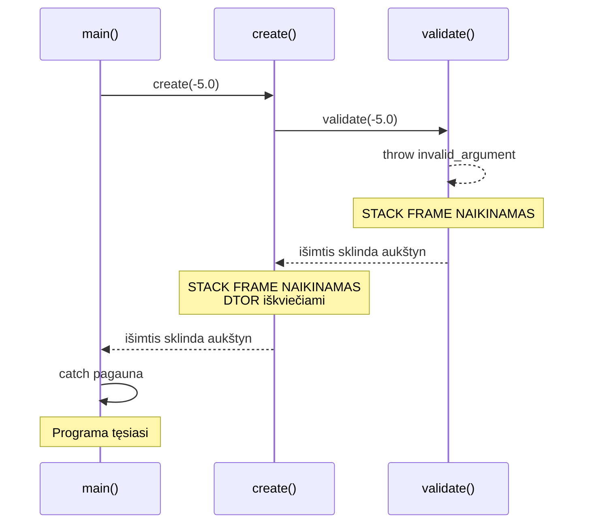
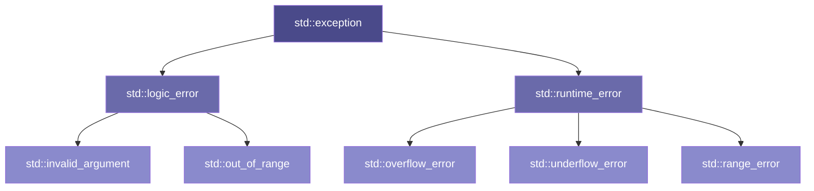

# Išimčių apdorojimas

---

## Trumpa įžanga: tęsinys nuo P06

P06 2 dalyje matėme `throw/try/catch` sintaksę pirmą kartą — `MyString::operator[]` kontekste.

Šioje paskaitoje — giliau. Bet pirma — konkreti problema:

```cpp linenums="1"
Circle c(0, 0, -5.0, "red");   // radius < 0 — kas nutinka?
c.area();                        // → grąžina neigiamą skaičių
c.printInfo();                   // → išspausdina neteisingą objektą
```

Konstruktorius **neturi grąžinamosios reikšmės** — negali grąžinti klaidos kodo.
P06 minėti C "klasikiniai" sprendimai (`errno` ir pan.) — konstruktoriuje neveikia.
`throw` — vienintelis logiškas sprendimas.

!!! note "Kodėl `throw/try/catch`, o ne `try/throw/catch`?"
    Vykdymo seka iš tikrųjų yra **try → throw → catch** — pirmiausia bandai, tada kažkas meta, tada pagauni.
    Tačiau konceptualiai pradedama nuo `throw`:

    - `throw` — **šaltinis**: sukuria išimtį. Be jo nebūtų ko gaudyti.
    - `try` — **kontekstas**: aplinka kurioje laukiama galimos išimties.
    - `catch` — **pasekmė**: reakcija į mestą išimtį.

    Programuotojų žargone dažniausiai išgirsite tiesiog **„try-catch blokas"** —
    nes `throw` dažnai pasislėpęs giliai kitose funkcijose ir jo tiesiog nematyti.

---

## 1 DALIS: `throw`, `try`, `catch` — mechanika

!!! abstract "Šios dalies tikslas"
    `throw/try/catch` sintaksė su pažįstamais `Shape` pavyzdžiais.
    Išimties objektas — kas tai ir kaip "keliauja" nuo `throw` iki `catch`.

---

### Du srautai

Normalus programos srautas — eilutė po eilutės, funkcija grąžina reikšmę, viskas nuoseklu. `throw` įveda **antrą srautą** — išimties kelią, kuriuo programa nutraukia dabartinį vykdymą ir šoka tiesiai į `catch` bloką, praleidžiant viską tarp jų.

Tai ne klaida ir ne katastrofa — tai **alternatyvus valdymo srautas**. Bet jį reikia sąmoningai valdyti.

---

### Sintaksė

`throw` **meta išimties objektą** — tai paprastas C++ objektas, paveldintis iš `std::exception`. Jis neša klaidos pranešimą ir tipą. `catch` jį pagauna pagal tipą — lygiai kaip funkcijos parametras.

!!! note "Python terminologija"
    Python tą pačią idėją vadina `raise` — iškelia. Aprašomesnis žodis tam pačiam veiksmui.
    C++ tradicija — `throw`. Abu reiškia: klaidos signalas keliauja aukštyn per
    funkcijų kvietimų seką — tai įprasta programų vykdymo architektūros ypatybė.

**Metame:**
```cpp linenums="1"
#include <stdexcept>   // ← std::invalid_argument ir kt.

throw std::invalid_argument("radius turi būti teigiamas");
//    ↑ išimties klasė      ↑ pranešimas (e.what() grąžins šį tekstą)
```

**Gauname:**
```cpp linenums="1"
try {
    Circle c(0, 0, -5.0, "red");   // ← čia konstruktorius mets išimtį
    c.printInfo();                   // ← ši eilutė NEBUS pasiekta
}
catch (const std::invalid_argument& e) {
    std::cout << "Klaida: " << e.what() << "\n";
    //                          ↑ grąžina pranešimą kurį perdavėme throw
}
```

!!! note "Išimties objektas — „po kapotu""
    `throw std::invalid_argument("tekstas")` sukuria objektą ir meta jį
    aukštyn per funkcijų kvietimų seką. `catch (const std::invalid_argument& e)` — tai **nuoroda**
    į tą objektą. `e.what()` grąžina pranešimą. Panašiai kaip funkcijos parametras —
    tik objektas "atkeliauja" ne iš kvietėjo, o iš `throw`.

Trys veikėjai:

- **`throw`** — meta išimties objektą ir **nedelsiant nutraukia** dabartinį vykdymą
- **`try`** — blokas, kuriame **stebime** ar bus iškelta išimtis
- **`catch`** — blokas, kuris **pagauna** išimties objektą ir jį apdoroja

---

### `Circle` su validacija

```cpp linenums="1"
// Circle.cpp:
Circle::Circle(double x, double y, double r, const std::string& color)
    : Shape(x, y, color), radius(r)
{
    if (r <= 0) {
        throw std::invalid_argument(
            "Circle: radius turi būti teigiamas, gauta: " + std::to_string(r)
        );
    }
    std::cout << "[Circle CTOR] r=" << radius << "\n";
}
```

```cpp linenums="1"
// main.cpp:
try {
    Circle good(0, 0, 5.0, "red");    // ✅ veikia
    good.printInfo();

    Circle bad(0, 0, -3.0, "blue");   // ← throw čia
    bad.printInfo();                   // ← NEPASIEKIAMA
}
catch (const std::invalid_argument& e) {
    std::cout << "Klaida: " << e.what() << "\n";
}

std::cout << "Programa tęsiasi...\n";  // ← pasiekiama
```

```
[Shape CTOR] color=red
[Circle CTOR] r=5
Circle [color=red, center=(0,0), r=5, area=78.54]
[Shape CTOR] color=blue
Klaida: Circle: radius turi būti teigiamas, gauta: -3.000000
Programa tęsiasi...
```

!!! warning "Atkreipkite dėmesį"
    `[Shape CTOR] color=blue` **spausdinamas** — `Shape` dalis spėjo inicializuotis.
    `[Circle CTOR]` — **nespausdinamas**, `throw` nutraukė prieš tai.
    `[Shape DTOR]` — **spausdinamas** — destruktorius iškviečiamas automatiškai. Apie tai — 2 dalyje.

!!! note "U7 — 2 žingsnis"
    `Circle` ir `Rectangle` konstruktorių validacija — savarankiškas darbas U7/02.

---

### Programa tęsiasi po klaidos

`catch` apdoroja klaidą — bet programa **tęsiasi** toliau. Tai esminis skirtumas nuo `exit()`:

```cpp linenums="1"
// Galima bandyti kurti objektus vieną po kito —
// klaida vienoje vietoje nesugriauna visko:
try { shapes.push_back(new Circle(0, 0, 3.0, "red")); }
catch (const std::exception& e) {
    std::cout << "Klaida: " << e.what() << "\n";   // užfiksuojame
}
// programa tęsiasi — bandome kitą
try { shapes.push_back(new Circle(1, 1, -2.0, "blue")); }
catch (const std::exception& e) {
    std::cout << "Klaida: " << e.what() << "\n";
}
```

!!! note "U7 — 3 žingsnis"
    `try/catch` grandinė su keliais objektais — savarankiškas darbas U7/03.

---

### `throw` metoduose — objektas lieka gyvas

Konstruktoriuje `throw` reiškia: objektas **nesukuriamas**. Metoduose — visai kas kita: objektas jau egzistuoja, ir po `throw` jis **lieka gyvas**.

```cpp linenums="1"
Circle c(0, 0, 5.0, "red");   // ✅ sukurtas teisingai
c.printInfo();                  // Circle r=5

try {
    c.setRadius(-3.0);          // ← throw čia
}
catch (const std::exception& e) {
    std::cout << "Klaida: " << e.what() << "\n";
}

c.printInfo();                  // Circle r=5 — nepakito!
```

```
[Shape CTOR] color=red
[Circle CTOR] r=5
Circle [color=red, center=(0,0), r=5, area=78.5398]
Klaida: Shape klaida: Circle: radius turi būti teigiamas, gauta: -3.000000
Circle [color=red, center=(0,0), r=5, area=78.5398]
```

Jokių `[DTOR]` — `c` niekur nedingo. `throw` nutraukė tik `setRadius()` vykdymą ir "šoko" į `catch`.

Kodėl `radius` nepakito? Nes priskyrimas yra **po** validacijos:

```cpp linenums="1"
void Circle::setRadius(double r) {
    if (r <= 0)
        throw ShapeException("...");   // ← čia sustojame
    radius = r;                        // ← čia NIEKADA nepasiekiame
}
```

Tai svarbus principas: metodas arba **pilnai pavyksta**, arba **objektas lieka nepakitęs** — jokios "pusiau pakeistos" būsenos.

!!! note "U7 — 4 žingsnis"
    `setRadius()` ir `setWidth()` su validacija — savarankiškas darbas U7/04.

---

### Kelios išimtys — kelios `catch` šakos

Kiekviena `catch (...)` eilutė — viena **šaka**, kaip `if/else if` grandinėje. Tik vietoj sąlygos — **išimties tipas**. Programa pasirenka pirmą šaką kurios tipas atitinka mestą išimtį:

```cpp linenums="1"
// Analogija su if/else if:
// if (tipas == invalid_argument) { ... }
// else if (tipas == runtime_error) { ... }
// else { ... }

try {
    Rectangle r(0, 0, -4.0, 3.0, "blue");
}
catch (const std::invalid_argument& e) {   // ← 1 šaka
    std::cout << "Neteisinga reikšmė: " << e.what() << "\n";
}
catch (const std::runtime_error& e) {      // ← 2 šaka
    std::cout << "Vykdymo klaida: " << e.what() << "\n";
}
catch (const std::exception& e) {          // ← 3 šaka — "else"
    std::cout << "Kita klaida: " << e.what() << "\n";
}
```

`catch` šakos tikrinamos **iš viršaus į apačią** — pirma tinkanti pagauna. Todėl: **specifinės viršuje, bendros apačioje** — lygiai kaip `if/else if` grandinėje pradedame nuo siauriausios sąlygos, ne nuo plačiausios. Jei `std::exception` būtų viršuje — ji pagautų viską, specifinės šakos niekada nepasiektų.

---

## 2 DALIS: Stack unwinding

!!! abstract "Šios dalies tikslas"
    Kas nutinka su objektais kai `throw` "šoka" per kelis lygmenis?
    Atsakymas: destruktoriai iškviečiami automatiškai — tai RAII garantija.

---

### Funkcijų grandinė ir `throw`

`throw` iš `validate()` — "šoka" per `create()`, per `main()` `try` bloką — tiesiai į `catch`. Visa tai — **stack unwinding**.

=== "`create(5.0)` — normalus atvejis"

    ```cpp linenums="1"
    #include <stdexcept>
    #include <iostream>

    void validate(double r) {
        if (r <= 0)
            throw std::invalid_argument("blogas radius");
    }

    void create(double r) {
        validate(r);               // ← validacija praėjo
        std::cout << "sukurta\n";  // ← PASIEKIAMA
    }

    int main() {
        try {
            create(5.0);
            std::cout << "ok\n";   // ← PASIEKIAMA
        }
        catch (const std::exception& e) {
            std::cout << "Pagauta: " << e.what() << "\n";
        }
    }
    ```

    ```
    sukurta
    ok
    ```

=== "`create(-5.0)` — išimtis mesta (iškelta)"

    ```cpp linenums="1"
    #include <stdexcept>
    #include <iostream>

    void validate(double r) {
        if (r <= 0)
            throw std::invalid_argument("blogas radius");
    }

    void create(double r) {
        validate(r);               // ← throw iš čia
        std::cout << "sukurta\n";  // ← NEPASIEKIAMA
    }

    int main() {
        try {
            create(-5.0);
            std::cout << "ok\n";   // ← NEPASIEKIAMA
        }
        catch (const std::exception& e) {
            std::cout << "Pagauta: " << e.what() << "\n";
        }
    }
    ```

    ```
    Pagauta: blogas radius
    ```

Atkreipkite dėmesį — `"sukurta"` ir `"ok"` **nespausdinami**. `throw` iš `validate()` "praleidžia" visą likusį `create()` ir `main()` kodą iki `catch`.

---

### Stack unwinding vizualiai (UML sekų diagrama)

Klasių diagrama rodė **struktūrą** — kas iš ko paveldi. Sekų diagrama rodo **laiką** — kas po ko iškviečiama ir kaip išimtis keliauja aukštyn.



Kiekvienas **stack frame** naikinamas — ir kiekvieno lokalūs objektai **sunaikinami** (destruktoriai iškviečiami). Tai ne atsitiktinumas — tai **RAII garantija**, kuri veikia net su išimtimis.

---

### Matome destruktorius logging'e

```cpp linenums="1"
void demonstracija() {
    Circle c1(0, 0, 3.0, "red");     // sukuriamas
    Circle c2(0, 0, -1.0, "blue");   // ← throw čia
    Circle c3(0, 0, 2.0, "green");   // ← NIEKADA nesukuriamas
}

int main() {
    try {
        demonstracija();
    }
    catch (const std::exception& e) {
        std::cout << "Pagauta: " << e.what() << "\n";
    }
}
```

```
[Shape CTOR] color=red
[Circle CTOR] r=3
[Shape CTOR] color=blue
[Circle DTOR] r=3        ← c1 sunaikinamas (stack unwinding)
[Shape DTOR] color=red   ← c1 Shape dalis
[Shape DTOR] color=blue  ← c2 Shape dalis (Circle nebuvo baigtas)
Pagauta: Circle: radius turi būti teigiamas, gauta: -1.000000
```

!!! note "RAII + išimtys = saugi sistema"
    Destruktoriai iškviečiami **nepriklausomai** nuo to ar programa baigėsi normaliai ar per išimtį.
    Tai reiškia — resursai atlaisvinami visada. Tai RAII principo esmė.

    Kol dirbame su **stack objektais** (be `new`) — sistema saugi automatiškai.

---

## 3 DALIS: `std::exception` hierarchija

!!! abstract "Šios dalies tikslas"
    `std::invalid_argument` — tik viena iš daugelio standartinių išimčių.
    Pažiūrėkime į hierarchiją — kodėl ji tokia ir kaip ją naudoti.

---

### Hierarchija



**Dvi pagrindinės šakos:**

- **`logic_error`** — klaida programos **logikoje**: blogas argumentas, indeksas už ribų. Teoriškai išvengiama kompiliavimo metu.
- **`runtime_error`** — klaida **vykdymo metu**: failas nerastas, persipildymas. Neišvengiama iš anksto.

---

### Kurią naudoti?

| Situacija | Išimtis |
|---|---|
| Blogas konstruktoriaus argumentas | `std::invalid_argument` |
| Indeksas už masyvo ribų | `std::out_of_range` |
| Matematinis persipildymas | `std::overflow_error` |
| Failas nerastas, tinklo klaida | `std::runtime_error` |
| Norite savo kategorijos | Paveldėkite iš tinkamos bazinės |

```cpp linenums="1"
// Circle konstruktorius:
if (r <= 0)
    throw std::invalid_argument("radius turi būti teigiamas");

// vector indeksavimas:
if (i >= size)
    throw std::out_of_range("indeksas " + std::to_string(i) + " už ribų");
```

---

### Sava išimčių klasė

Kartais standartinių neužtenka — norisi savo kategorijos:

```cpp linenums="1"
// ShapeException.h:
#include <stdexcept>
#include <string>

class ShapeException : public std::invalid_argument {
public:
    explicit ShapeException(const std::string& msg)
        : std::invalid_argument("Shape klaida: " + msg) {}
};
```

```cpp linenums="1"
// Circle.cpp:
if (r <= 0)
    throw ShapeException("Circle radius=" + std::to_string(r) + " turi būti > 0");

// main.cpp — galima pagauti pagal tipą:
catch (const ShapeException& e) {
    std::cout << "Shape validacijos klaida: " << e.what() << "\n";
}
catch (const std::exception& e) {
    std::cout << "Kita klaida: " << e.what() << "\n";
}
```

Paveldėjimas veikia ir išimčių hierarchijoje — `catch (const std::exception& e)` pagauna ir `ShapeException`, nes ji **yra** `std::exception`.

!!! note "`catch (const std::exception& e)` — pažįstami elementai"
    Šis parametras gali atrodyti sudėtingai, bet jį sudaro dalys kurias jau žinote:

    - **`const`** — `e` tik skaitome (`e.what()`), nekeičiame. *Const correctness* — kaip ir funkcijų parametruose.
    - **`std::exception&`** — **nuoroda**, ne kopija. Efektyvu, ir išsaugo tikrąjį objekto tipą.
    - **`std::exception`** — **bazinė klasė**. `catch` pagauna ir `ShapeException`, ir `std::invalid_argument`, ir viską kas paveldi iš `std::exception`.

    Tai **upcasting** su nuoroda — ta pati paveldėjimo mechanika kaip `Shape& s = circle`, tik ne su rodykle o su nuoroda. `e.what()` — **polimorfinis** kvietimas: iškviečiamas tikrojo objekto `what()`, ne bazinės klasės.

!!! note "U7 — 5 žingsnis"
    `ShapeException` — sava išimčių klasė su `catch` pagal tipą — savarankiškas darbas U7/05.

---

## 4 DALIS: `new`, `throw` ir atminties nutekėjimas

!!! abstract "Šios dalies tikslas"
    Stack unwinding saugo **stack objektus**. Bet kas nutinka su **heap objektais** —
    kai naudojame `new` ir `throw` kartu?

---

### Problema

Jau matėme, kad rankinis dinaminės atminties valdymas — rodyklės, `new`/`delete` — reikalauja disciplinos. Shallow copy, Rule of Three, `delete` kiekviename išėjimo taške... O dabar prie to pridedame `throw`:

```cpp linenums="1"
void sukurti() {
    Shape* s = new Circle(0, 0, 5.0, "red");   // ← heap alokacija

    throw std::runtime_error("kažkas negerai"); // ← throw čia

    delete s;      // ← NEPASIEKIAMA
}
```

`delete s` nepasiekiamas — atmintis **nuteka**. Stack unwinding sunaikina `s` kintamąjį (rodyklę) — bet ne objektą, į kurį ji rodo. Rodyklė dingo, objektas heap'e — niekas jo neišvalo.

Tai ta pati rodyklių problema, tik nauju pavidalu — ir vėl rankinis valdymas "atsikeršija".

### Iliustracija su logging'u

```cpp linenums="1"
void sukurti() {
    Shape* s = new Circle(0, 0, 5.0, "red");
    throw std::runtime_error("kažkas negerai");
    delete s;   // ← nepasiekiama
}

int main() {
    try { sukurti(); }
    catch (const std::exception& e) {
        std::cout << "Pagauta: " << e.what() << "\n";
    }
}
```

```
[Shape CTOR] color=red
[Circle CTOR] r=5
Pagauta: kažkas negerai
```

`[Circle DTOR]` ir `[Shape DTOR]` — **niekada nespausdinami**. Objektas sukurtas, bet neišvalytas. Atminties nutekėjimas.

---

### Sprendimas egzistuoja

Problema **išsprendžiama** — bet tai jau kito įrankio tema.

```cpp linenums="1"
// Užuomina į P10:
#include <memory>

void sukurti() {
    auto s = std::make_unique<Circle>(0, 0, 5.0, "red");
    // ↑ ne new/delete — unique_ptr

    throw std::runtime_error("kažkas negerai");
    // ↑ throw čia — bet unique_ptr destruktorius
    //   iškviečiamas automatiškai (stack unwinding!)
    //   Atminties nutekėjimo nėra.
}
```

```
[Shape CTOR] color=red
[Circle CTOR] r=5
[Circle DTOR] r=5        ← dabar iškviečiamas ✅
[Shape DTOR] color=red   ← dabar iškviečiamas ✅
Pagauta: kažkas negerai
```

`std::unique_ptr` — tai RAII pritaikytas heap objektams. Stack unwinding veikia nes `unique_ptr` pats yra **stack objektas**, kurio destruktorius kviečia `delete`. Tai **P10** tema.

!!! tip "Žvilgsnis į priekį: P10"
    `new`/`delete` + išimtys = atminties nutekėjimo pavojus.
    `unique_ptr` + išimtys = saugi automatiškai.
    
    RAII principas, kurį žinote nuo P06 — čia pasirodo pilna jėga.

---

!!! tip "Užduotis U7"
    Išimčių mechaniką išbandysite **U7 žingsniuose 1–5**:

    - **Žingsnis 1:** `BankAccount` su `throw` — apšilimas
    - **Žingsnis 2:** `Circle`/`Rectangle` validacija konstruktoriuose
    - **Žingsnis 3:** `try/catch` `main.cpp` — sugauti ir tęsti
    - **Žingsnis 4:** `setRadius()` su `throw` — ne tik konstruktoriuje
    - **Žingsnis 5:** Sava išimčių klasė

---

*[RAII]: Resource Acquisition Is Initialization
*[NC]: Not Compiling — Nesikompiliuoja
