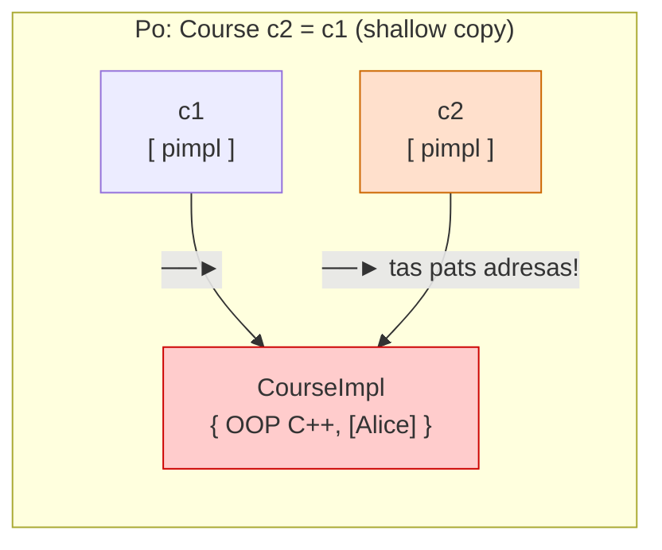

# U2 Gidas: Kompozicija, **_pimpl_**, _Deep Copy_, Išimtys

## Ką reikia padaryti:

1. Išskaidyti kodą į `.h` / `.cpp`, `main.cpp` – atskirai
2. Naudoti `pimpl` (forward declaration + pointer)
3. Įgyvendinti Rule of Three (deep copy)
4. Išlaikyti `id` ir `liveCount`
5. Naudoti išimtis (`throw`, `try/catch`)
6. Turėti Makefile (`all`, `clean`, `build`)

## Motyvacija:

U1 užduotyje sukūrėme klasę su laukais, metodais, konstruktoriumi ir destruktoriumi. 

U1 lygmenyje klasė buvo „viename faile“, o jos vidus — pilnai matomas.
`private/public` leidžia kontroliuoti prieigą klasės viduje, bet
neatskiria klasės realizacijos nuo kitų programos dalių.

Didėjant klasei (daugiau laukų, ryšių, logikos), jos vidus tampa
sudėtingas ir kintantis. Atsiranda poreikis:

- atskirti sąsają nuo realizacijos
- sumažinti, kiek kiti failai „žino“ apie klasės vidų

Tam naudojamas `.h` / `.cpp` skaidymas ir `pimpl`.

!!! example "Šio Gido pavyzdys per visą dokumentą:"
    **`Course`** klasė, kuri turi (_has-a_ ryšys - kompozicija), t.y. įkomponuoja **`Student`** klasės objektų sąrašą/masyvą.

---

## Tiltas iš U1

### Ką turime po U1 (tariamas supaprastintas pavyzdys)

```cpp linenums="1"
// Viskas viename faile: MyClass.cpp / main.cpp
class Student {
    std::string name;   // char* name;
    int age;
public:
    Student(const std::string& n, int a) : name(n), age(a) {}
    ~Student() {}
    void print() const { std::cout << name << ", " << age << "\n"; }
};

int main() {
    Student s("Alice", 20);
    s.print();
}
```

!!! question "Kodėl šioje medžiagoje pasirinktas `Course` + `Student`, o ne `Student`— juk U1 esybė yra `Student`?!"
    **_pimpl_** (technika) prasminga kai klasė turi **sudėtingą arba kintamą realizaciją**, kurią verta paslėpti. `Student` — paprastas: tik `name` ir `age`. Nėra ko slėpti, nėra priklausomybių kurios keistųsi.

    `Course` — kita istorija: viduje turi `vector<Student>`,
    gali turėti ryšį su duomenų baze , failo įkėlimą, cache'avimą...
    Ir svarbiausia — kiekvienas, kas naudoja `Course`, automatiškai
    priklausytų nuo `Student` (ir, savo ruožtu, nuo visko ką `Student.h` įtraukia).

    **Taisyklė:** **_pimpl_** naudojamas kai klasės realizacija:

    - turi savo priklausomybių (`#include`) kurių nenori atskleisti/eksponuoti
    - gali keistis nepriklausomai nuo sąsajos
    - yra sudėtinga dėl ko ženkliai ilgėja kompiliavimosi laikas

    **Svarbu:** ne kiekvienai klasei reikia `pimpl`.
    Jis prasmingas tik tada, kai klasė turi ką „slėpti“.

    `Student` šių sąlygų neatitinka — jam `pimpl` būtų
    perteklinis komplikavimas (_overengineering_).

    Jūsų U2 užduotyje — taikykite **_pimpl_** **savo U1 esybei**, bet susimąstylite: ar jos realizacija pakankamai sudėtinga?
    Jei ir ne... — **_pimpl_** užduotyje U2 numatytas kaip **technikos demonstracija**, net jei realiai čia jo ir nenaudotumėte.

### Kokios problemos liko po U1

Kad įgyvendinti **U2 reikalavimus** spręsime šias problemas:

???+ danger "1 problema: vidinė realizacija matoma visiems"
    Jei `Course.h` antraštėje matomi visi privatūs laukai —
    kiekvienas, kas `#include "Course.h"`, **mato realizacijos detales**.
    Pakeitus privatų lauką — **perkompiliuojami visi**, kas įtraukė tą antraštę.

??? danger "2 problema: kopija "tyliai" dalijasi atmintimi su originalu"
    Jei klasė viduje turi/savinasi dinaminius resursus (`new`) —
    numatytoji kopija kopijuoja laukus (adresus), o ne pačius duomenis.
    Du objektai (originalas ir kopija) rodo į **tą pačią atmintį** → sunaikinus vieną, kitas "sugadinamas".

??? danger "3 problema: klaidos "tyliai" ignoruojamos"
    Be klaidų/išimčių prevencijos/apdorojimo, neleistini konstruktoriaus argumentai (t.y. nelogiškos / klaidingos (nevaliduotos) reikšmės) nustato ir palieka objektą "kritinėje"/ **"sugadintoje" būsenoje**... be jokios galimybės tai aptikti...

Trumpas atsakymas:

- **`pimpl`** sprendžia 1-ą problemą
- **_deep copy_** — 2-ą
- **`throw`** — 3-ią.

Na, bet... eikime papunkčiui:

---

## 1. Išskaidymas į `.h` / `.cpp`

**Tikslas:** naudoti klasę iš kitų failų

### Kodėl skaidome?

- Programos skaidomos į mažesnes dalis (modulius), kad būtų lengviau jas kurti ir suprasti
- C/C++: kiekvienas .cpp failas yra atskirai kompiliuojamas
→ todėl kiekvienas `.cpp` failas turi turėti visą jam reikalingą informaciją (per `#include`)
- Todėl kompiliuojant vieną `.cpp` failą, kiti failai nėra matomi
→ todėl reikia būdo „pasakyti“ kompiliatoriui, kas egzistuoja kituose failuose
- .h – deklaracijos (kas egzistuoja: klasės, funkcijos)
- .cpp – apibrėžimai (kaip tai realizuota)
- main.cpp (ir kiti failai) naudoja #include, kad per .h sužinotų apie kitus modulius
- Net ir turint private/public, klasės turi būti „matomos“ kituose failuose, todėl deklaracijos iškeliamos į `.h`

### Išskaidymo pavyzdys

=== "Student.h"

    ```cpp linenums="1"
    #pragma once
    #include <string>
    #include <iostream>

    class Student {
        std::string name;
        int age;
    public:
        Student(const std::string& n, int a);
        ~Student();
        void print() const;
        std::string getName() const;
    };
    ```

=== "Student.cpp"

    ```cpp linenums="1"
    #include "Student.h"

    Student::Student(const std::string& n, int a)
        : name(n), age(a) {}

    Student::~Student() {}

    void Student::print() const {
        std::cout << name << ", " << age << "\n";
    }

    std::string Student::getName() const {
        return name;
    }
    ```

=== "main.cpp"

    ```cpp linenums="1"
    #include "Student.h"

    int main() {
        Student s("Alice", 20);
        s.print();
        return 0;
    }
    ```

---

## 2. Kompozicija → `pimpl`

**Tikslas:** paslėpti realizaciją

### Pradinis taškas: `Course` su `Student` "sąrašu"

T.y.`Course` naudodamas **kompozicijos** (**_has-a_** ryšį) turi/talpina `Student` objektų `vector`'ių:

=== "Course.h"

    ```cpp linenums="1"
    #pragma once
    #include "Student.h"       // Student pilnai matomas visiems!
    #include <vector>
    #include <string>

    class Course {
        std::string title;
        std::vector<Student> students;   // tiesioginis has-a narys - kompozicija
    public:
        Course(const std::string& t);
        void add(const std::string& name, int age);
        void print() const;
    };
    ```

=== "Course.cpp"

    ```cpp linenums="1"
    #include "Course.h"
    #include <iostream>

    Course::Course(const std::string& t) : title(t) {}

    void Course::add(const std::string& name, int age) {
        students.push_back(Student(name, age));
    }

    void Course::print() const {
        std::cout << "Course: " << title << "\n";
        for (const auto& s : students)   // range-based for — šiuolaikiškas (Modern C++11)
            s.print();
        // ADS dalyko kontekste pasidomėkite ir
        // klasikiniu iteratoriaus variantu (ekvivalentus):
        // for (auto it = students.begin(); it != students.end(); ++it)
        //     it->print();
    }
    ```

=== "main.cpp"

    ```cpp linenums="1"
    #include "Course.h"
    // Course.h viduje yra #include "Student.h" —
    // todėl main.cpp "mato" Student tipą!

    int main() {
        Course c("OOP C++");
        c.add("Alice", 20);
        c.add("Bob",   21);
        c.print();

        // Kadangi Course.h įtraukė Student.h — galime kurti
        // Student objektus tiesiogiai main() viduje:
        Student s("Charlie", 22);
        s.print();

        return 0;
    }
    ```

=== "🖥️"

    ```
    Course: OOP C++
    Alice, 20
    Bob, 21
    Charlie, 22
    ```

??? warning "Taigi - Problema 1: Course.h atskleidžia per daug"
    `main.cpp` įtraukė tik `Course.h` — bet per jį **automatiškai** gavo ir `Student.h`. Todėl `Student s(...)` veikia net be explicit `#include "Student.h"`.

    Tai yra **netiesioginė priklausomybė** — pavojinga:
    jei ateityje `Course.h` nustotų įtraukti `Student.h`,
    `main.cpp` nustotų kompiliuotis, nors jo kodas nepakito.

    Be to — kiekvienas `#include "Course.h"` mato visus `Student` ir `Course` privačius laukus. Pakeitus bet kurį — **perkompiliuojama viskas**.

---

**Kas keičiasi:**

- `title` ir `students` nebededami tiesiai į `Course`
- jie perkeliami į paslėptą struktūrą `CourseImpl`
- `Course` saugo tik rodyklę (`pimpl`) į šią struktūrą

### Refactoring'as (perprojektavimas): ta pati `Course`, bet su `pimpl`

Sprendimas — **perkelti/paslėpti** `students` vektorių (plačiau - kolekciją, ar tiesiog - masyvą) ir `title` eilutę į atskirą struktūrą, matomą tik `.cpp` faile:

=== "Course.h (su pimpl)"

    ```cpp linenums="1" hl_lines="5 6 14"
    #pragma once
    #include <string>
    // Student.h čia NEBEREIKIA! — naudotojas nežino apie Student

    struct CourseImpl;   // forward declaration:
                         //   kompiliatoriui pažadame kad šis tipas egzistuoja,
                         //   bet jo sandaros čia neatskleisime —
                         //   pilnas apibrėžimas bus TIK .cpp faile

    class Course {
    public:
        Course(const std::string& title);
        ~Course();

        void add(const std::string& name, int age);
        void print() const;

    private:
        CourseImpl* pimpl;       // rodyklė — ne pati struktūra
    };
    ```

=== "Course.cpp (su pimpl)"

    ```cpp linenums="1" hl_lines="5-10 13 17"
    #include "Course.h"
    #include "Student.h"        // matomas TIK čia
    #include <vector>
    #include <iostream>

    struct CourseImpl {          // pilnas apibrėžimas — TIK šiame faile
    //  ^^^^^^
    //  struct, o ne class — kodėl?
    //  struct nariai numatyta PUBLIC, class — PRIVATE.
    //  CourseImpl yra tik duomenų konteineris (title + students),
    //  jokios logikos, jokio paslėpimo — struct čia natūraliau.
    //  Galima rašyti ir class CourseImpl { public: ... }; — rezultatas tas pats.
        std::string title;
        std::vector<Student> students;
    };

    Course::Course(const std::string& title)
        : pimpl(new CourseImpl{title, {}}) {}
    //         ─────────────────────────
    //         new CourseImpl{...} — sukuriame pimpl dinaminėje atmintyje
    //         {title, {}}        — agregatinė inicializacija:
    //                                 title    ← iš parametro
    //                                 students ← {} tuščias vektorius
    //
    // Klasikinė alternatyva be {} inicializacijos:
    //   Course::Course(const std::string& t) {
    //       pimpl = new CourseImpl();  // sukuriame tuščią
    //       pimpl->title = t;          // paskui priskiriame
    //   }

    Course::~Course() {
        delete pimpl;             // MES atsakome už sunaikinimą
    }

    void Course::add(const std::string& name, int age) {
        pimpl->students.push_back(Student(name, age));
    }

    void Course::print() const {
        std::cout << "Course: " << pimpl->title << "\n";
        for (const auto& s : pimpl->students)   // range-based for
            s.print();
        // Klasikinis iteratoriaus variantas (ekvivalentus):
        // for (auto it = pimpl->students.begin(); it != pimpl->students.end(); ++it)
        //     it->print();
    }
    ```

    ```cpp linenums="1"
    #include "Course.h"
    // Course.h dabar NEĮTRAUKIA Student.h —
    // main.cpp nežino kas yra Student!

    int main() {
        Course c("OOP C++");
        c.add("Alice", 20);   // ← studentus pridedame per Course metodą
        c.add("Bob",   21);   //   main() nežino kaip jie saugomi viduje
        c.print();

        // Student s("Charlie", 22);  // ← ❌ NC: 'Student' was not declared
                                      //   Student paslėptas Course viduje!
        return 0;
    }
    ```

=== "🖥️"

    ```
    Course: OOP C++
    Alice, 20
    Bob, 21
    ```

??? success "Ką gavome su pimpl"
    - `main.cpp` **nemato** `CourseImpl` — nei `title`, nei `students`, nei `Student`
    - Pakeitus `CourseImpl` vidų — `main.cpp` **nereikia rekompiliuoti**
    - `Course` destruktorius **valdo** `pimpl` gyvavimą — tai **kompozicija** su `CourseImpl*`

??? question "O kas jei tiesiog pridėsiu `#include "Student.h"` į main.cpp?"
    Techniškai — **veiks**. Niekas nedraudžia. Bet pagalvokime:

    ```cpp
    #include "Course.h"
    #include "Student.h"   // ← papildoma priklausomybė
    ```

    Dabar `main.cpp` tiesiogiai žino apie `Student`. Tai reiškia:

    - Jei `Student` klasė pervadinama → reikia keisti `main.cpp`
    - Jei `Student` perkelta į kitą biblioteką → reikia keisti `main.cpp`
    - Jei `Student.h` keičia laukus → `main.cpp` **rekompiliuojamas**

    ...nors `main.cpp` tiesiogiai su `Student` **nedirba** — jis tik naudoja `Course`!

    **Analogija (Pasiūlyta DI):** jūs užsisakote picą per programėlę. Jums nereikia žinoti
    iš kurio sandėlio atkeliauja miltai. Galite sužinoti — bet tada kiekvienas
    sandėlio pasikeitimas taptų ir **jūsų problema**.

    `pimpl` tikslas — ne **uždrausti** žinoti apie `Student`,
    o **atsieti** `main.cpp` nuo `Course` vidinių sprendimų.
    `main.cpp` turėtų žinoti tik tiek, kiek jam **reikia darbui**.

    !!! note "Projektavimo principas"
        Tai vadinasi **priklausomybių minimizavimas** (_dependency minimization_)
        arba **minimalių žinių principas** (_Law of Demeter_):
        kiekvienas modulis turėtų žinoti kuo mažiau apie kitus.

        Mažiau priklausomybių → lengviau keisti → lengviau prižiūrėti.
        Tai svarbu net ir mažuose projektuose — o didelėse sistemose
        tai **išgyvenimo klausimas**.

---

??? note "C++ _pimpl_ ir C _opaque pointer_ technikos — tas pats principas!"

    Detaliau žr. Stack ADT Evoliucija C kalboje (08-09 etapai):

    ```
    ┌─────────────────────────────────────────────────────────────────┐
    │                    C  (Stage 07)                                │
    │                                                                 │
    │   stack.h:    struct Stack;          ← forward declaration      │
    │               Stack* create();       ← tik rodyklė              │
    │                                                                 │
    │   stack.c:    struct Stack {         ← pilnas apibrėžimas       │
    │                   int data[SIZE];    ← TIK čia matoma           │
    │                   int top;                                      │
    │               };                                                │
    └─────────────────────────────────────────────────────────────────┘

    ┌─────────────────────────────────────────────────────────────────┐
    │                    C++  (pimpl)                                 │
    │                                                                 │
    │   Course.h:   struct CourseImpl;     ← forward declaration      │
    │               CourseImpl* pimpl;     ← tik rodyklė              │
    │                                                                 │
    │   Course.cpp: struct CourseImpl {    ← pilnas apibrėžimas       │
    │                   std::string title; ← TIK čia matoma           │
    │                   vector<Student>...                            │
    │               };                                                │
    └─────────────────────────────────────────────────────────────────┘
    ```

    **Idėja identiška** — skiriasi tik sintaksė ir tai, kad C++ klasė
    valdo `pimpl` gyvavimą **automatiškai** per konstruktorių/destruktorių.

    | | C opaque pointer | C++ pimpl |
    |---|---|---|
    | **Paslėpimas** | `struct Stack` — forward decl | `struct CourseImpl` — forward decl |
    | **Rodyklė** | `Stack* s` — rankinis valdymas | `CourseImpl* pimpl` — per klasę |
    | **Sukūrimas** | `Stack* s = create()` — rankinis | konstruktorius — **automatinis** |
    | **Sunaikinimas** | `destroy(s)` — rankinis, galima pamiršti | destruktorius — **automatinis** |

    !!! note "Tai ir yra C++ vertė"
        `pimpl` ne išranda naują principą — jis **automatizuoja** tai,
        ką C programuotojas darė rankiniu būdu.

---

## 3. Shallow vs Deep copy

**Problema:** neteisingas kopijavimas po `pimpl`

### Problema

Su `pimpl` atsiranda nauja rizika:

```cpp linenums="1" hl_lines="5"
int main() {
    Course c1("OOP C++");
    c1.add("Alice", 20);

    Course c2 = c1;    // ← atrodo nekaltai...

    c2.add("Bob", 21);
    c1.print();        // tikimasi: tik Alice
                       // gausime: Alice IR Bob
}
```

=== "🖥️ (tikėtasi)"

    ```
    Course: OOP C++
    Alice, 20
    ```

=== "🖥️ (realybė — arba crash)"

    ```
    Course: OOP C++
    Alice, 20
    Bob, 21
    ```
    Arba `double free` crash programos pabaigoje.

### Kaas vyksta?

Numatytasis copy constructor kopijuoja laukus **bitų lygmeniu** (_shallow copy_):

Abi klasės (`c1` ir `c2`) turi savo rodyklę,
bet abi rodyklės rodo į tą pačią `CourseImpl` struktūrą.



### Sprendimas: Rule of Three

Jei klasė turi destruktorių kuris `delete` kažką — beveik tikrai
reikia ir copy constructor, ir `operator=`:

| Metodas | Kada kviečiamas |
|---|---|
| `~Course()` | Objektas sunaikinamas |
| `Course(const Course&)` | `Course c2 = c1;` arba perdavimas į funkciją |
| `Course& operator=(const Course&)` | `c2 = c1;` (abu jau egzistuoja) |

=== "Course.h (Rule of Three)"

    ```cpp linenums="1" hl_lines="10-12"
    #pragma once
    #include <string>

    struct CourseImpl;

    class Course {
    public:
        Course(const std::string& title);
        ~Course();

        Course(const Course& other);              // copy constructor
        Course& operator=(const Course& other);   // copy assignment

        void add(const std::string& name, int age);
        void print() const;

    private:
        CourseImpl* pimpl;
    };
    ```

=== "Course.cpp (Rule of Three)"

    ```cpp linenums="1"
    #include "Course.h"
    #include "Student.h"
    #include <vector>
    #include <iostream>

    struct CourseImpl {
        std::string title;
        std::vector<Student> students;
    };

    Course::Course(const std::string& title)
        : pimpl(new CourseImpl{title, {}}) {}
    // sukuriame pimpl heap'e ir iš karto inicializuojame:
    // title = parametras, students = {} tuščias vektorius
    // `{}` – C++11 uniform initialization (galima galvoti kaip įprastą konstruktoriaus kvietimą)


    // Deep copy: sukuriame NAUJĄ CourseImpl su tuo pačiu turiniu
    Course::Course(const Course& other)
        : pimpl(new CourseImpl{*other.pimpl}) {}

    // `*other.pimpl` — kopijuojame visą struktūros turinį (ne adresą).
    // `std::vector` ir `std::string` tai daro automatiškai (deep copy).


    // Copy assignment operator: tas pats kaip copy ctor,
    // tik jau egzistuojančiam objektui
    Course& Course::operator=(const Course& other) {
        if (this != &other) {           // savęs priskyrimo patikra

            // 1. atlaisviname seną resursą
            delete pimpl;

            // 2. sukuriame NAUJĄ kopiją (deep copy)
            pimpl = new CourseImpl{*other.pimpl};
        }
        return *this;
    }

    void Course::add(const std::string& name, int age) {
        pimpl->students.push_back(Student(name, age));
    }

    void Course::print() const {
        std::cout << "Course: " << pimpl->title << "\n";
        for (const auto& s : pimpl->students)
            s.print();
    }
    ```

=== "main.cpp (testas)"

    ```cpp linenums="1"
    #include "Course.h"
    #include <iostream>

    int main() {
        Course c1("OOP C++");
        c1.add("Alice", 20);

        Course c2 = c1;        // copy constructor
        c2.add("Bob", 21);

        std::cout << "c1:\n"; c1.print();   // tik Alice
        std::cout << "c2:\n"; c2.print();   // Alice + Bob

        Course c3("Empty");
        c3 = c1;               // operator=
        std::cout << "c3:\n"; c3.print();   // tik Alice

        return 0;
    }
    ```

=== "🖥️"

    ```
    c1:
    Course: OOP C++
    Alice, 20
    c2:
    Course: OOP C++
    Alice, 20
    Bob, 21
    c3:
    Course: OOP C++
    Alice, 20
    ```

---

## 4. `id`, `liveCount`, `nextId` su `pimpl`

### Kur jie atsiduria?

```cpp linenums="1"
class Course {
    // ── Klasės lygmens laukai — ČIA ──────────────────
    int id;                    // objekto tapatybė
    static int nextId;         // id generatorius
    static int liveCount;      // gyvų objektų skaitliukas

    // ── Realizacijos detalės — Impl viduje ───────────
    CourseImpl* pimpl;          // title, students...
};
```

**Kodėl ne `pimpl` viduje?**
- `liveCount` skaičiuoja **klasės objektus** — priklauso klasei, ne pimpl
- `id` — objekto **tapatybė**, ne realizacijos detalė
- `nextId` — klasės lygio generatorius

??? info "`static` narys `struct` viduje — galima, bet ne čia"
    Techniškai leidžiama, bet tada jis priklausytų `CourseImpl` tipui —
    ne `Course`. `liveCount` turi skaičiuoti `Course` objektus.

### Subtilybė: `id` kopijuojant

```cpp linenums="1"
// Variantas A — kopija gauna TĄ PATĮ id
Course::Course(const Course& other)
    : id(other.id),               // ← du objektai su tuo pačiu id!
      pimpl(new CourseImpl{*other.pimpl}) {
    ++liveCount;
}

// Variantas B — kopija gauna NAUJĄ id
Course::Course(const Course& other)
    : id(nextId++),               // ← unikalus id kiekvienam objektui
      pimpl(new CourseImpl{*other.pimpl}) {
    ++liveCount;
}
```

| | Variantas A | Variantas B |
|---|---|---|
| **Logika** | Kopija = tas pats „daiktas" | Kopija = naujas atskiras objektas |
| **Tinka kai** | id = DB raktas | id = atminties objekto tapatybė |

!!! tip "Svarbiausia"
    Pasirinkimas turi būti **sąmoningas ir nuoseklus**.
    `liveCount` turi didėti **abiejuose** konstruktoriuose —
    ir pagrindiniame, ir kopijavimo.

---

## 5. Išimtys: `throw` / `try` / `catch`

### Sava išimties klasė

```cpp linenums="1"
// CourseException.h
#pragma once
#include <stdexcept>
#include <string>

class CourseException : public std::runtime_error {
public:
    explicit CourseException(const std::string& reason)
        : std::runtime_error("CourseException: " + reason) {}
};
```

### `throw` konstruktoriuje ir metode

```cpp linenums="1" hl_lines="4-6 11-13"
Course::Course(const std::string& title)
    : pimpl(nullptr) {
    if (title.empty())
        throw CourseException("Title cannot be empty");
    if (title.length() > 100)
        throw CourseException("Title too long");
    pimpl = new CourseImpl{title, {}};
}

void Course::add(const std::string& name, int age) {
    if (name.empty())
        throw std::invalid_argument("Student name cannot be empty");
    if (age <= 0 || age > 150)
        throw std::invalid_argument("Invalid age");
    pimpl->students.push_back(Student(name, age));
}
```

### `try` / `catch` su rezultatų failu

```cpp linenums="1"
#include "Course.h"
#include "CourseException.h"
#include <iostream>
#include <fstream>

void runTests(std::ostream& out) {
    // ── Sėkmingas atvejis ───────────────────────────
    try {
        Course c("OOP C++");
        c.add("Alice", 20);
        c.print();
        out << "OK: Course created successfully\n";
    } catch (const CourseException& e) {
        out << "FAIL: " << e.what() << "\n";
    }

    // ── Klaida: tuščias pavadinimas ─────────────────
    try {
        Course c("");
        out << "FAIL: should have thrown!\n";
    } catch (const CourseException& e) {
        out << "OK: caught: " << e.what() << "\n";
    }

    // ── Klaida: netinkamas amžius ───────────────────
    try {
        Course c("Math");
        c.add("Bob", -5);
        out << "FAIL: should have thrown!\n";
    } catch (const std::invalid_argument& e) {
        out << "OK: caught: " << e.what() << "\n";
    }
}

int main() {
    // Ekranas:
    runTests(std::cout);

    // Failas:
    std::ofstream file("results.txt");
    runTests(file);

    return 0;
}
```

=== "🖥️"

    ```
    Course: OOP C++
    Alice, 20
    OK: Course created successfully
    OK: caught: CourseException: Title cannot be empty
    OK: caught: Invalid age
    ```

!!! tip "`catch` eilės tvarka — svarbu!"
    Konkretesnės išimtys — **pirmiau**. `std::exception` — paskutinė.
    Jei `std::exception` būtų pirma — konkretaus tipo catch niekada
    nebūtų pasiektas.

---

## 6. Makefile

### Kompiliavimo grandinė

```
Student.cpp  ──► [g++] ──►  Student.o  ┐
Course.cpp   ──► [g++] ──►  Course.o   ├──► [linker] ──► program
main.cpp     ──► [g++] ──►  main.o     ┘
```

### Minimalus Makefile

```makefile
CXX      = g++
CXXFLAGS = -std=c++17 -Wall -Wextra

SRCS   = Student.cpp Course.cpp main.cpp
OBJS   = $(SRCS:.cpp=.o)
TARGET = program

# ── Pagrindiniai tikslai ──────────────────────────
all: $(TARGET)

$(TARGET): $(OBJS)
	$(CXX) $(CXXFLAGS) -o $@ $^

%.o: %.cpp
	$(CXX) $(CXXFLAGS) -c $< -o $@

# ── Pagalbiniai tikslai ───────────────────────────
clean:
	rm -f $(OBJS) $(TARGET) results.txt

build: clean all

# ── Priklausomybės ────────────────────────────────
Student.o:          Student.cpp Student.h
Course.o:           Course.cpp Course.h Student.h
main.o:             main.cpp Course.h
```

!!! warning "Tabuliacija — ne tarpai!"
    Makefile komandose prieš `$(CXX)` — būtina `Tab`, ne tarpai.

=== "Linux / Mac"

    ```bash
    make && ./program
    make clean
    make build
    ```

=== "Windows (MinGW)"

    ```bash
    mingw32-make && program.exe
    mingw32-make clean
    ```

---

## ✅ U2 kontrolinis sąrašas

#### Struktūra

- [ ] Klasė išskaidyta į `.h` ir `.cpp` failus
- [ ] `main()` yra **atskirame** `.cpp` faile
- [ ] `pimpl`: antraštėje tik `ImplStruct*` + forward declaration
- [ ] `XxxImpl` struktūra matoma **tik** `.cpp` faile

#### Rule of Three

- [ ] Destruktorius naikina `pimpl` (`delete pimpl`)
- [ ] Copy constructor sukuria **naują** `pimpl` (gilus kopijavimas)
- [ ] `operator=` turi savęs priskyrimo patikrą (`if (this != &other)`)
- [ ] Testas: pakeitimas vienoje kopijoje **nepaveikia** kitos

#### `id` ir `liveCount`

- [ ] `id`, `nextId`, `liveCount` yra **klasėje** (ne `Impl`)
- [ ] `liveCount` didėja **copy constructor'yje** (ne tik pagrindiniame!)
- [ ] `liveCount` mažėja destruktoriuje
- [ ] `id` kopijai — sąmoningas ir **nuoseklus** pasirinkimas

#### Išimtys

- [ ] Sava išimties klasė (paveldi iš `std::exception` ar išvestinės)
- [ ] `throw` bent dviejose vietose (konstruktoriuje + metode)
- [ ] `try/catch` testuoja **sėkmingą** IR **klaidingą** atvejį
- [ ] Rezultatai — ekrane **IR** tekstiniame faile

#### Makefile

- [ ] Tikslai: `all`, `clean`, `build`
- [ ] Generuojami `.o` failai
- [ ] Nurodytos priklausomybės nuo `.h`

---

## Papildomos/Alternatyvios technikos bonusams

??? tip "Bonus I: `CourseImpl` kaip atskiras modulis"
    Patobulinimas: **`pimpl` modulyje**

    Pagrindiniame variante `CourseImpl` apibrėžiamas `Course.cpp` viduje.
    Tai paprasta technika ir dažniausiai jos pakanka. Tačiau yra ir **stipresnis** variantas:
    `CourseImpl` kaip **atskiras kompiliavimo modulis** — su savo `.h` ir `.cpp` failai.

    **Kompiliavimo priklausomybių palyginimas:**

    ```
    Variantas A (įprastas):        Variantas B (patobulintas):
    ─────────────────────────        ──────────────────────────────────
    Course.h                         Course.h
      struct CourseImpl; ←             struct CourseImpl; ←
    Course.cpp                       CourseImpl.h  ← NAUJAS
      struct CourseImpl { ... }        struct CourseImpl { ... }
      // visa pimpl viduje           CourseImpl.cpp  ← NAUJAS
                                       // CourseImpl realizacija
                                   Course.cpp
                                       #include "CourseImpl.h"
                                       // tik Course logika
    ```

    **Priklausomybių diagrama (mermaid):**

    ```mermaid
    graph TD
        subgraph "Variantas A"
            mA[main.cpp] -->|include| chA[Course.h]
            ccA[Course.cpp] -->|include| chA
            ccA -->|include| shA[Student.h]
            note1["CourseImpl apibrėžtas\nCourse.cpp viduje"]
        end
        subgraph "Variantas B"
            mB[main.cpp] -->|include| chB[Course.h]
            ccB[Course.cpp] -->|include| chB
            ccB -->|include| cih[CourseImpl.h]
            cicp[CourseImpl.cpp] -->|include| cih
            cicp -->|include| shB[Student.h]
        end
        style note1 fill:#ffffcc
    ```

    ??? note "ASCII diagrama"
        ```
        Variantas A:              Variantas B:
        main.cpp                  main.cpp
          └─► Course.h              └─► Course.h
        Course.cpp                Course.cpp
          ├─► Course.h              ├─► Course.h
          └─► Student.h             └─► CourseImpl.h
                                  CourseImpl.cpp
                                    ├─► CourseImpl.h
                                    └─► Student.h
        ```

    **Kodas:**

    === "CourseImpl.h"

        ```cpp linenums="1"
        #pragma once
        #include "Student.h"
        #include <vector>
        #include <string>

        struct CourseImpl {
            std::string title;
            std::vector<Student> students;
        };
        ```

    === "CourseImpl.cpp"

        ```cpp linenums="1"
        #include "CourseImpl.h"
        // Čia galėtų būti CourseImpl metodai jei reikia.
        // Paprastam pimpl dažnai tuščias — struktūra tik duomenys.
        ```

    === "Course.h"

        ```cpp linenums="1"
        #pragma once
        #include <string>

        struct CourseImpl;   // forward declaration — kaip ir anksčiau!
                             // CourseImpl.h čia NEBEREIKIA

        class Course {
        public:
            Course(const std::string& title);
            ~Course();
            Course(const Course& other);
            Course& operator=(const Course& other);

            void add(const std::string& name, int age);
            void print() const;

        private:
            CourseImpl* pimpl;
        };
        ```

    === "Course.cpp"

        ```cpp linenums="1"
        #include "Course.h"
        #include "CourseImpl.h"   // ← dabar čia, ne Course.h!
        #include <iostream>

        Course::Course(const std::string& title)
            : pimpl(new CourseImpl{title, {}}) {}

        Course::~Course() { delete pimpl; }

        Course::Course(const Course& other)
            : pimpl(new CourseImpl{*other.pimpl}) {}

            // `*other.pimpl` — kopijuojame visą struktūros turinį (ne adresą).
            // `std::vector` ir `std::string` tai daro automatiškai (deep copy).


        Course& Course::operator=(const Course& other) {
            if (this != &other) {
                delete pimpl;
                pimpl = new CourseImpl{*other.pimpl};
            }
            return *this;
        }

        void Course::add(const std::string& name, int age) {
            pimpl->students.push_back(Student(name, age));
        }

        void Course::print() const {
            std::cout << "Course: " << pimpl->title << "\n";
            for (const auto& s : pimpl->students)
                s.print();
        }
        ```

    === "Makefile (papildytas)"

        ```makefile
        SRCS = Student.cpp CourseImpl.cpp Course.cpp main.cpp

        # Priklausomybės:
        CourseImpl.o:  CourseImpl.cpp CourseImpl.h Student.h
        Course.o:      Course.cpp Course.h CourseImpl.h
        main.o:        main.cpp Course.h
        ```

    **Ką tai duoda:**

    - Pakeitus `CourseImpl` **realizaciją** — rekompiliuojamas tik `CourseImpl.cpp`
    - `Course.cpp` nereikia rekompiliuoti jei `CourseImpl.h` nepakito
    - Didelėse sistemose tai **reikšmingai** sutrumpina kompiliavimo laiką

---

??? tip "Bonus II: Copy constructor ir Rule of Three detaliau"

    Tikslas: pamatyti, kada ir kiek kartų iš tikrųjų kuriami ir naikinami objektai.
    Šis "eksperimentas" turi tris žingsnius:

    1. **Pamatome problemą** — daugiau destruktorių nei konstruktorių
    2. **Atrandame priežastį** — copy constructor
    3. **Patobuliname sprendimą** — `operator=` ir `liveCount` stebėjimas

    ---

    Žingsnis 1: Protokolo neatitikimas

    Pridėkite logging'ą į `Course` konstruktorius:

    ```cpp linenums="1"
    Course::Course(const std::string& title)
        : id(nextId++), pimpl(new CourseImpl{title, {}}) {
        ++liveCount;
        std::cout << "[CTOR] Course('" << pimpl->title
                  << "') id=" << id
                  << " live=" << liveCount << "\n";
    }

    Course::~Course() {
        --liveCount;
        std::cout << "[DTOR] Course('" << pimpl->title
                  << "') id=" << id
                  << " live=" << liveCount << "\n";
        delete pimpl;
    }
    ```

    **Paleiskite šį testą — dar be copy constructor:**

    ```cpp linenums="1"
    void printCourse(Course c) {   // ← perdavimas pagal reikšmę — kopija!
        c.print();
    }

    int main() {
        std::cout << "=== Sukuriame c1 ===\n";
        Course c1("OOP C++");
        c1.add("Alice", 20);
        c1.add("Bob",   21);

        std::cout << "\n=== Kopija: c2 = c1 ===\n";
        Course c2 = c1;

        std::cout << "\n=== Perdavimas į funkciją ===\n";
        printCourse(c1);

        std::cout << "\n=== Pabaiga main() ===\n";
        return 0;
    }
    ```

    === "🖥️ (be [COPY])"

        ```
        === Sukuriame c1 ===
        [CTOR] Course('OOP C++') id=1 live=1

        === Kopija: c2 = c1 ===

        === Perdavimas į funkciją ===
        Course: OOP C++
        Alice, 20
        Bob, 21
        [DTOR] Course('OOP C++') id=? live=?

        === Pabaiga main() ===
        [DTOR] Course('OOP C++') id=? live=?
        [DTOR] Course('OOP C++') id=? live=?
        ```

    !!! question "Tad - klausimas:"
        Matome **1 konstruktorių**, bet **3 destruktorius**.
        Kas sukūrė kitus du objektus? Kur jų konstruktoriai?

    ---

    Žingsnis 2: Copy constructor — paslėptas kūrėjas

    Pridėkite copy constructor su logging'u:

    ```cpp linenums="1"
    Course::Course(const Course& other)
        : id(nextId++), pimpl(new CourseImpl{*other.pimpl}) {
        ++liveCount;
        std::cout << "[COPY] Course('" << pimpl->title
                  << "') id=" << id
                  << " (kopijuota iš id=" << other.id << ")"
                  << " live=" << liveCount << "\n";
    }
    ```

    === "🖥️ (su [COPY])"

        ```
        === Sukuriame c1 ===
        [CTOR] Course('OOP C++') id=1 live=1

        === Kopija: c2 = c1 ===
        [COPY] Course('OOP C++') id=2 (kopijuota iš id=1) live=2

        === Perdavimas į funkciją ===
        [COPY] Course('OOP C++') id=3 (kopijuota iš id=1) live=3
        Course: OOP C++
        Alice, 20
        Bob, 21
        [DTOR] Course('OOP C++') id=3 live=2   ← funkcijos parametras

        === Pabaiga main() ===
        [DTOR] Course('OOP C++') id=2 live=1   ← c2
        [DTOR] Course('OOP C++') id=1 live=0   ← c1
        ```

    Dabar **kiekvienas [CTOR]/[COPY] turi lygiai vieną [DTOR]** —
    3 sukūrimai, 3 sunaikinimai. ✓

    `liveCount` trajektorija:
    ```
    po CTOR:      live=1
    po COPY c2:   live=2
    po COPY f():  live=3
    po DTOR f():  live=2
    po DTOR c2:   live=1
    po DTOR c1:   live=0  ← programa baigiasi tvarkingai
    ```

    ---

    Žingsnis 3: `operator=` — kai objektas jau egzistuoja

    Copy constructor veikia kai objektas **kuriamas**.
    Kai jis jau egzistuoja ir priskiriam naują reikšmę — `operator=`:

    ```cpp linenums="1"
    Course& Course::operator=(const Course& other) {
        std::cout << "[ASSIGN] Course id=" << id
                  << " ← id=" << other.id << "\n";
        if (this != &other) {           // savęs priskyrimo patikra
            delete pimpl;
            pimpl = new CourseImpl{*other.pimpl};
            // id nekeičiame — objektas lieka tas pats, turinys keičiasi
        }
        return *this;
    }
    ```

    **Testas:**

    ```cpp linenums="1"
    int main() {
        Course c1("OOP C++");
        c1.add("Alice", 20);

        Course c2("Matematika");
        c2.add("Charlie", 22);

        std::cout << "--- Prieš priskyrimą ---\n";
        std::cout << "c1: "; c1.print();
        std::cout << "c2: "; c2.print();
        std::cout << "live=" << Course::getLiveCount() << "\n";

        std::cout << "\n--- c2 = c1 (operator=) ---\n";
        c2 = c1;

        std::cout << "\n--- Po priskyrimo ---\n";
        std::cout << "c1: "; c1.print();
        std::cout << "c2: "; c2.print();
        std::cout << "live=" << Course::getLiveCount() << "\n";

        std::cout << "\n--- Keičiame c2 ---\n";
        c2.add("Dave", 23);
        std::cout << "c1: "; c1.print();   // nepakito!
        std::cout << "c2: "; c2.print();

        std::cout << "\n--- Savęs priskyrimas ---\n";
        c1 = c1;   // saugus dėl if (this != &other)

        std::cout << "\n--- Pabaiga ---\n";
        return 0;
    }
    ```

    === "🖥️"

        ```
        [CTOR] Course('OOP C++') id=1 live=1
        [CTOR] Course('Matematika') id=2 live=2

        --- Prieš priskyrimą ---
        c1: Course: OOP C++
        Alice, 20
        c2: Course: Matematika
        Charlie, 22
        live=2

        --- c2 = c1 (operator=) ---
        [ASSIGN] Course id=2 ← id=1

        --- Po priskyrimo ---
        c1: Course: OOP C++
        Alice, 20
        c2: Course: OOP C++
        Alice, 20
        live=2

        --- Keičiame c2 ---
        c1: Course: OOP C++
        Alice, 20
        c2: Course: OOP C++
        Alice, 20
        Dave, 23

        --- Savęs priskyrimas ---
        [ASSIGN] Course id=1 ← id=1
        (nieko nedaro — this == &other)

        --- Pabaiga ---
        [DTOR] Course('OOP C++') id=2 live=1
        [DTOR] Course('OOP C++') id=1 live=0
        ```

    ??? note "Pastebėjimai"
        - Po `c2 = c1` — abu turi tą patį **turinį**, bet skirtingus **id**
          (c2 lieka id=2 — `operator=` nekuria naujo objekto)
        - `liveCount` nepakito po priskyrimo — iš tiesų taip ir turi būti
        - `c2.add("Dave")` — **nepaveikia** c1 — gilus kopijavimas veikia ✓
        - Savęs priskyrimas `c1 = c1` — saugus dėl `if (this != &other)` patikros

    ---

    Apibendrinimas: Rule of Three (Trijų Taisyklė)

    | Metodas | Kviečiamas kai | Žymė |
    |---|---|---|
    | `Course(const std::string&)` | Naujas objektas | `[CTOR]` |
    | `Course(const Course&)` | `c2 = c1` kūrimo metu, perdavimas į f-ją | `[COPY]` |
    | `operator=` | `c2 = c1` kai abu jau egzistuoja | `[ASSIGN]` |
    | `~Course()` | Objektas sunaikinamas | `[DTOR]` |

    !!! tip "Skirtumas: copy constructor vs operator="
        ```cpp
        Course c2 = c1;   // ← COPY CONSTRUCTOR: c2 dar neegzistavo
        c2 = c1;          // ← OPERATOR=: c2 jau egzistuoja
        ```
    
    Atrodo panašiai — bet tai du skirtingi metodai!

---

??? tip "Bonus III: kompozicija be `vector` — "tikrasis" _deep copy_ (iššūkis)"

    Šiame variante sąmoningai atsisakome `std::vector`,
    kad pamatytume „tikrą“ deep copy problemą ir sprendimą rankiniu būdu.

    Pagrindiniame pavyzdyje `CourseImpl` naudoja `std::vector<Student>` —
    kuris pats yra RAII konteineris ir deep copy atlieka **automatiškai**.
    Todėl `new CourseImpl{*other.pimpl}` veikia be papildomo darbo.

    Bet kas jei `CourseImpl` viduje būtų **tikras dinaminis masyvas** —
    kaip U1 užduotyje? Tada deep copy problema atsiskleidžia visa jėga.

    !!! note "Ryšys su U1"
        U1 užduotyje kūrėte dinaminius masyvus: `T* arr = new T[n]`.
        Čia tas pats — tik `CourseImpl` viduje.

    ---

    `CourseImpl` su dinaminiu masyvu

    ```cpp linenums="1"
    // Course.cpp — CourseImpl su rankiniu masyvu
    struct CourseImpl {
        std::string  title;
        Student*     students;   // dinaminis masyvas — ne vector!
        int          count;      // dabartinis studentų kiekis
        int          capacity;   // masyvo talpa

        // Pagalbinis konstruktorius
        CourseImpl(const std::string& t, int cap = 4)
            : title(t), count(0), capacity(cap) {
            students = new Student[capacity];
            std::cout << "[IMPL_CTOR] CourseImpl '" << title
                      << "' cap=" << capacity << "\n";
        }

        ~CourseImpl() {
            std::cout << "[IMPL_DTOR] CourseImpl '" << title << "'\n";
            delete[] students;   // ← būtina!
        }
    };
    ```

    `add()` su dinamišku augimu

    ```cpp linenums="1"
    void Course::add(const std::string& name, int age) {
        // Jei pilna — padidiname talpą dvigubai
        if (pimpl->count == pimpl->capacity) {
            int newCap = pimpl->capacity * 2;
            Student* newArr = new Student[newCap];

            // Kopijuojame senus studentus
            for (int i = 0; i < pimpl->count; ++i)
                newArr[i] = pimpl->students[i];

            delete[] pimpl->students;   // senas masyvas — šalin
            pimpl->students = newArr;
            pimpl->capacity = newCap;

            std::cout << "[GROW] capacity: " << pimpl->capacity << "\n";
        }
        pimpl->students[pimpl->count++] = Student(name, age);
    }
    ```

    Shallow copy problema — aiškesnė nei su `vector`

    ```cpp linenums="1"
    // Be copy constructor — kompiliatorius kopijuoja tik rodyklę!
    Course c1("OOP C++");
    c1.add("Alice", 20);

    Course c2 = c1;   // shallow copy: c2.pimpl == c1.pimpl!
                      // abu rodo į TĄ PATĮ CourseImpl,
                      // o CourseImpl::students — TĄ PATĮ masyvą!
    ```

    ```
    c1:  [ pimpl ──►  CourseImpl { "OOP C++", students──►[Alice] } ]
                                ↑
    c2:  [ pimpl ─────────────── ]   ← tas pats CourseImpl!
                                         tas pats students masyvas!
    ```

    Sunaikinus `c2` — `delete[] students` pirmą kartą.
    Sunaikinus `c1` — `delete[] students` antrą kartą → **double free crash**.

    "Tikrasis" deep copy — rankinis.

    Dabar `new CourseImpl{*other.pimpl}` **nebeveikia** —
    reikia kopijuoti laukas po lauko:

    ```cpp linenums="1"
    // Copy constructor — RANKINIS deep copy
    Course::Course(const Course& other) : id(nextId++) {
        ++liveCount;
        // Sukuriame NAUJĄ CourseImpl su ta pačia talpa
        pimpl = new CourseImpl(other.pimpl->title,
                               other.pimpl->capacity);
        // Kopijuojame kiekvieną studentą atskirai
        pimpl->count = other.pimpl->count;
        for (int i = 0; i < pimpl->count; ++i)
            pimpl->students[i] = other.pimpl->students[i];

        std::cout << "[COPY] Course('" << pimpl->title
                  << "') id=" << id << "\n";
    }

    // operator= — rankinis deep copy su savęs priskyrimo patikra
    Course& Course::operator=(const Course& other) {
        std::cout << "[ASSIGN] id=" << id
                  << " ← id=" << other.id << "\n";
        if (this == &other) return *this;

        // Sunaikinamas senas pimpl
        delete pimpl;

        // Sukuriamas naujas su kito turiniu
        pimpl = new CourseImpl(other.pimpl->title,
                               other.pimpl->capacity);
        pimpl->count = other.pimpl->count;
        for (int i = 0; i < pimpl->count; ++i)
            pimpl->students[i] = other.pimpl->students[i];

        return *this;
    }
    ```

    Testas su logging

    ```cpp linenums="1"
    int main() {
        Course c1("OOP C++");
        c1.add("Alice", 20);
        c1.add("Bob",   21);
        c1.add("Charlie", 22);   // ← gali sukelti GROW

        std::cout << "\n--- Kopija ---\n";
        Course c2 = c1;

        c2.add("Dave", 23);      // ← keičiame tik c2

        std::cout << "\nc1: "; c1.print();
        std::cout << "c2: "; c2.print();
        return 0;
    }
    ```

    === "🖥️"

        ```
        [IMPL_CTOR] CourseImpl 'OOP C++' cap=4
        [CTOR] Course('OOP C++') id=1 live=1
        [CTOR] Student 'Alice'
        [CTOR] Student 'Bob'
        [CTOR] Student 'Charlie'

        --- Kopija ---
        [IMPL_CTOR] CourseImpl 'OOP C++' cap=4
        [COPY] Course('OOP C++') id=2
        [CTOR] Student 'Dave'

        c1: Course: OOP C++
        Alice, 20
        Bob, 21
        Charlie, 22
        c2: Course: OOP C++
        Alice, 20
        Bob, 21
        Charlie, 22
        Dave, 23

        [IMPL_DTOR] CourseImpl 'OOP C++'
        [DTOR] Course('OOP C++') id=2 live=1
        [IMPL_DTOR] CourseImpl 'OOP C++'
        [DTOR] Course('OOP C++') id=1 live=0
        ```

    Kiekvienas `CourseImpl` sunaikinamas atskirai — du `[IMPL_DTOR]`. ✓

    ---

    Palyginimas: `vector` vs dinaminis masyvas

    | | `vector<Student>` | `Student*` + `count` |
    |---|---|---|
    | **Deep copy** | Automatinis (`*other.pimpl`) | Rankinis (ciklas) |
    | **Atminties valdymas** | `vector` valdo | Mes valdome |
    | **`add()` sudėtingumas** | `push_back()` | Rankinis `GROW` |
    | **Ryšys su U1** | Silpnas | **Tiesioginis** |
    | **Klaidos rizika** | Maža | Didelė (bet mokanti!) |
    | **Tinkamas** | Produkciniam kodui | **Mokymuisi** |
